# Questions on Large Language Models

## Transformers

### What is Q K V?

### Why division by $\sqrt{d_k}$, where k is the head size
Normalizing the distribution of softmax, preventing gradient vanishing. This could also be realted to initilization.

### Are there other ways to achieve similar functions to self-attention?
### Are there any other way than divided by $\sqrt{d_k}$?
Any methods that could keep the weights within the inverval is good. See Google T5 (good normalization).
### They reason why transformers use Layer Norm
Preventing vanishing gradient.
### Why does not use Batch Norm
- Sequence length of NLP tasks are not the same across each batch
- hard to scale batch sizes since Transformers are usually very large

## Attention
  
### Why multi-head attention
- It could enable different heads to focus on different parts when handling sentences

### Flash Attention
It is an IO-aware exact attention algorithm that reduces memory reads/writes between GPU high-bandwidth memory (HBM) and on-chip SRAM by utilizing tiling techniques.

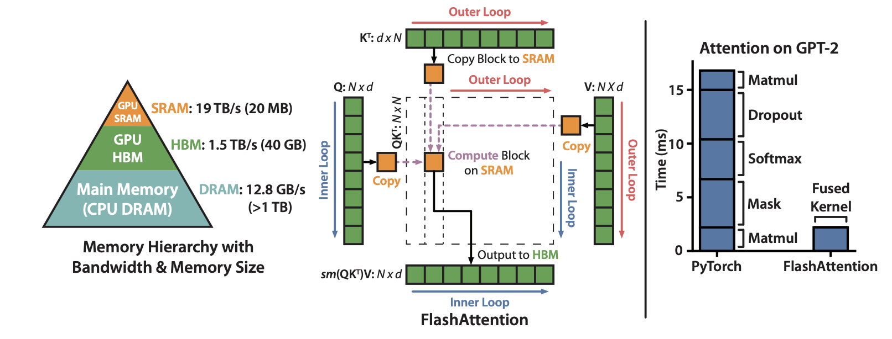
1. **Tiling**: Restructure Algorithm to load block by block from HBM to SRAM to compute attention. It decomposed softmax into small blocks and then rescale it. (One key point is the calculation of softmax without overflow).
   - Load inputs by blocks from HBM to SRAM
   - On the chip, compute attn output wrt the block
   - Update output on HBM by scaling
2. **Recomputation**: Do not store attn. matrix from forward, recompute it in backward. Efficient since normalization factors have been stored previously.  
3. 

### Multihead Latent Attention
A picture of types of attn:
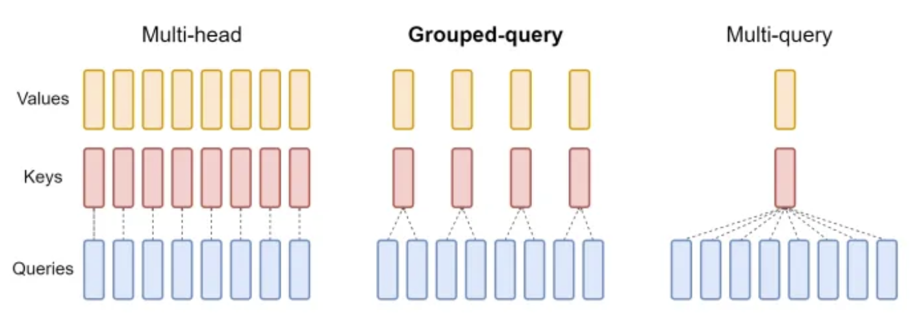

MLA seeks a balance between memory efficiency and modeling accuracy.

The basic idea of MLA is to compress the attention input $h_t$ into a low-dimensional latent vector with dimension $d_c$, where $d_c$ is much lower than the original ($h_n$ · $d_h$). 

**Problems with RoPE:**
It has problems when applied RoPE to it since when multiplying Q and K together, the up-projection matrix should be contracted. However, since RoPE are index-dependent, it cannot did so. 

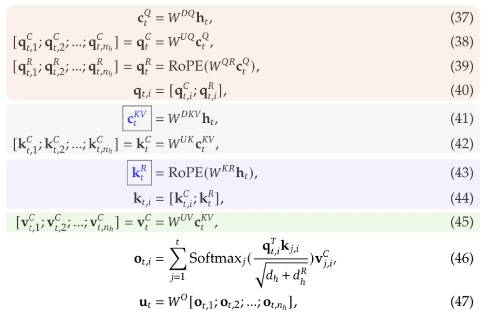

Instead, the author decoupled the RoPE into two separate vectors and concatenate with the key and value.

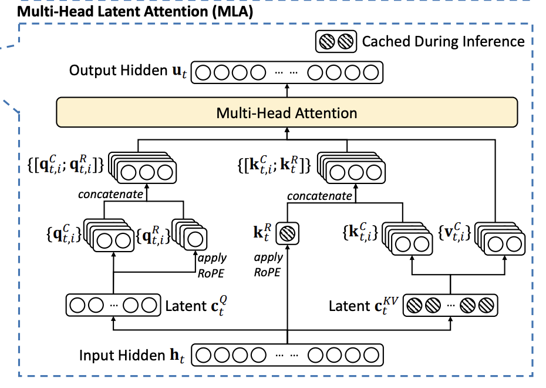

## Positional Encoding
[Link](https://0809zheng.github.io/2022/07/01/posencode.html)
#### What is the shortcomings of learnable PE?
You cannot exprapolate since the length of learnable parameters are typically fixed.
#### Sinusoidal Embeddings
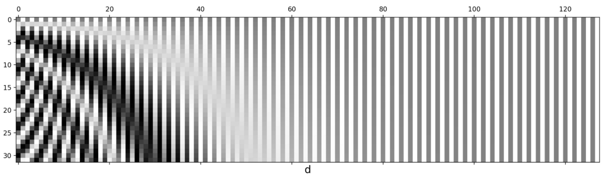
Formula:
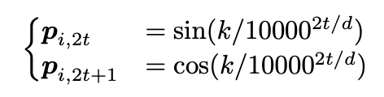
Pros and Cons\
Pros:
- It is very bad at extrapolation. It may not have an ideal on how to deal with very long sequences.
- Sin and Cos functions are continuous, providing **smooth** information
- No additional trainable paprameters
- 
Cons:
- No relative information, not expressive enough
- Fixed frequency, not necessarily optimal for every NLP tasks.

#### RoPE
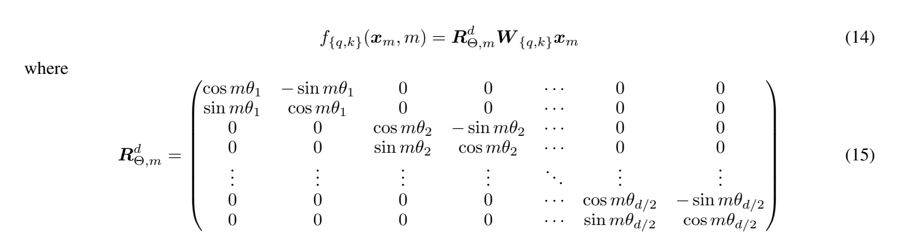
Pros and Cons\
Pros:
- Encodes relative position naturally, depending on relative positions, making it easier to generalize.
- It is based on continuous rotation, so it could handle longer sequences.
- It is parameter efficient and cheap to compute
  
Cons:
- Does not encode absolute position, hard for tasks require absolute position
- Hard to interpret since it is complex
  

### Different types of attention

### Parameter Calculation (only include decoder block)
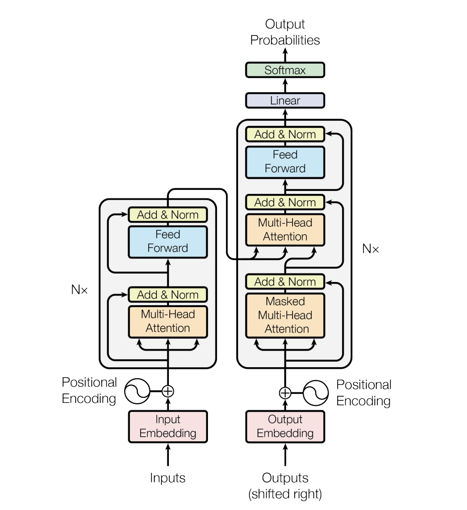
Let $d_h$ denote the hidden state size of the model, $d_{qkv}$ denote the dimension of the vector of $Q, K, V$, $N$ denote the size of heads. Then we have:

1. **The size of the Scaled Dot Product Attention** is: $W_Q + W_K + W_B + W_O$ = $(d_{h}*d_{qkv} + d_{qkv})*3h + d_{h}*d_{h} + d_{h}$ = $4*d_{h}^2$
   
2. **The size of the MLP** is: $d_{h}*d_{ffn} + d_{h} + d_{h}*d_{ffn} + d_{ffn}$

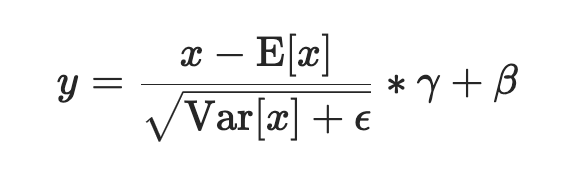
3. **The size of Layer Norm** is: $\beta, \gamma$ = $d_{h}$, which is $d_{h}*2$
4. **Output size** is: $d_{h}*d_{vocab}$

## Tokenizer
### Byte Pair Encoding

1. Start with a vocabulary containing only characters and an "end-of-word" token.
2. Using corpus of texts, find the most common adjacent pair of characters "a,b"; add "ab"as a subword.
3. Replace instances of the character pair with the new subword; repeat until the desired vocabulary size.

It effectively solves the problem of the problem of the out-of-vocabulary problem.

### Sentence Piece

# Model Training
## Pretraining
### Initialization
1. Random Initialization
2. Truncated Initialization
   
   There are more variations in nomral init, and the result is bounded in uniform init. So, combining these two advantages in both, we have the truncated init. a and b are two standard deviation away from the mean. The real variance is $\gamma \sigma^2$. To get the real variance, one should pass the standard deviations as $\frac{\sigma}{\sqrt{\gamma}}$.
3. Xavier Initialization
   
   Xavier initialization, also known as Glorot initialization, is a method for setting neural network weights to keep the variance of activations roughly the same across layers. It does this by drawing initial weights from a distribution with a variance that depends on the number of input and output neurons, helping to mitigate the vanishing or exploding gradient problems during training.

4. NTK init
   
   Neural Tangent Kernel (NTK) initialization is a weight initialization scheme designed to ensure that deep neural networks behave like kernel methods in the infinite-width limit, preserving signal propagation and avoiding vanishing or exploding gradients. It scales weights based on the layer width, typically using $\mathcal{N}(0, \frac{2}{\text{fan-in}})$ for ReLU networks, ensuring stable gradient dynamics during training. So given the previous case in Xavier init, we need the $D=N(0, \frac{1}{m})$ as an initialization. So we could divide the output by $\frac{1}{\sqrt{m}}$ to get the same effect.

   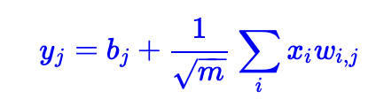

### Norm
#### RMS Norm
Formulation:

$$\text{RMSNorm}(x) = \frac{x}{\sqrt{\frac{1}{n}\sum{x_i^2 + \epsilon}}}$$

- layer norm center the data while RMS norm does not center the data (normalizing using the mean value across feature), thus it is more efficient.
- RMS also preserve the original information of the data since only scale the data.

#### Layer Norm
Pros: 
- Stablize training and convergence.
- Works well for sequence model since it does not. depends on batch sizes and normalizes across features.

Cons:
- Higher computation overhead.
- Adds up two more learnable parameters.
- Less effective for CNN.

#### Differences between pre norm and post norm
[prenorm vs postnorm](https://sh-tsang.medium.com/review-pre-ln-transformer-on-layer-normalization-in-the-transformer-architecture-b6c91a89e9ab)

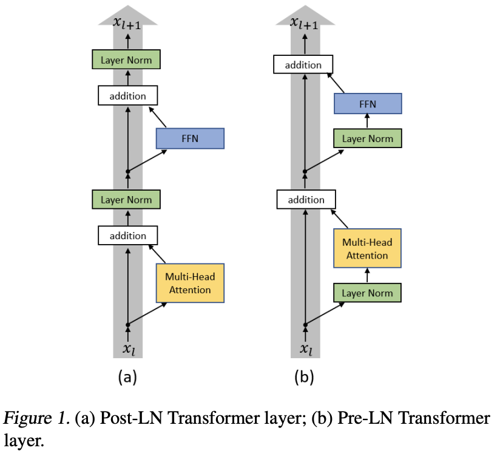

PreNorm tends to be helpful to stabalize the model training since it allows **more freely** residual connections. However, it is easy to be trapped into local optima. PostNorm is more difficult to train but it helps adds the depth of the models.

#### Post Deepnorm

### Warm up

### Batch Skipping (Palm Paper)

### Weight Decay
### Gradient Clipping

### ZeRO
#### ZeRO 1
#### ZeRO 2
#### ZeRO 3

## Finetuning
### Difference between LoRA and SFT
### LoRA
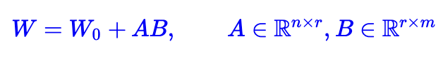
The assumption is that during pretraining, the parameters of the models are very large. However, the intrinsic dimension of downstream tasks are not large. So, instead of finetuning the full weights, only modify A and B. The typical r is 8, under somecases, r could even be equal to 1. 

#### Does Lora really save the computational amount?
It depends on how lora is realized. We have two different ways of implementing lora. Two ways of initialization is as follows:

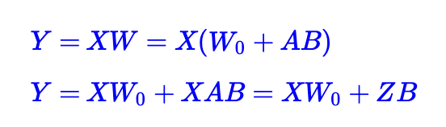

please see [link](https://kexue.fm/archives/9590/comment-page-2#comments) for detailed explanation.

### Proximal Policy Optimization (PPO)

On-Policy Formulation:
$$
\nabla_\theta J(\theta) = \mathbb{E}_{\tau \sim \pi_\theta} \left[ \sum_{t=0}^{T} \nabla_\theta \log \pi_\theta (a_t | s_t) G_t \right]
$$

where:

- \( J(\theta) \) is the objective function, typically the expected cumulative reward.
- \( \pi_\theta (a_t | s_t) \) is the policy parameterized by \( \theta \), giving the probability of taking action \( a_t \) in state \( s_t \).
- \( \nabla_\theta \log \pi_\theta (a_t | s_t) \) is the score function, representing how the log-probability of an action changes with respect to policy parameters.
- \( G_t = \sum_{k=t}^{T} \gamma^{k-t} r_k \) is the return, i.e., the sum of future discounted rewards from time step \( t \).
- \( \gamma \in (0,1] \) is the discount factor.
- The expectation \( \mathbb{E}_{\tau \sim \pi_\theta} \) is taken over trajectories \( \tau \) sampled from the policy \( \pi_\theta \).

### Direct Preference Optimization (DPO)

## Inference
### What is speculative decoding?

It speeds up autoregressive text generation by using a fast proposal model to predict several tokens at once, which are then selectively confirmed by a slower, more accurate model. Keypoint is that you should have **a fast approximation model**.

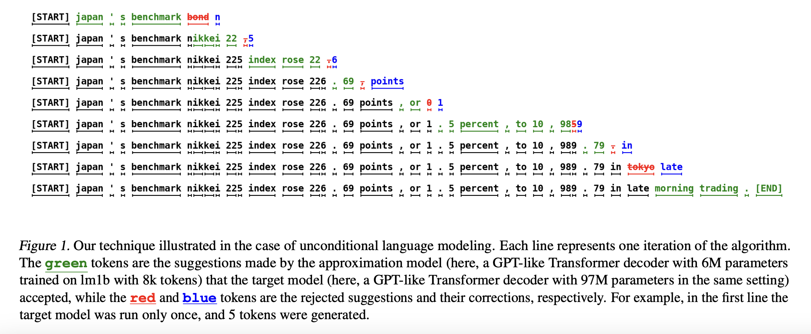

### Why LLM repeats themselves, and how to solve this problem?

### Deepspeed

