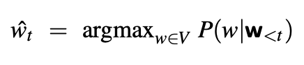
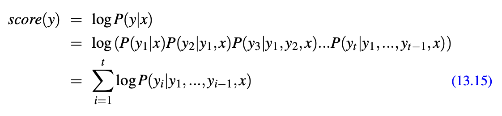
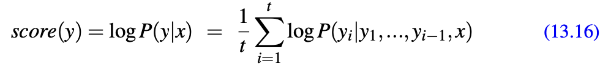
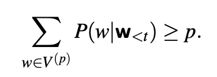
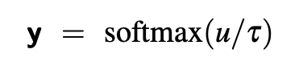
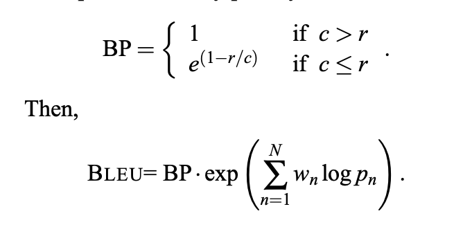
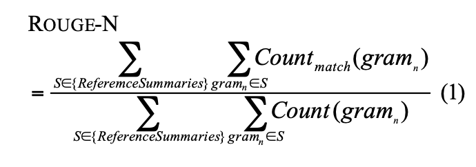

# Natural Language Process

### Dependency Parser

#### Nueral Dependency Parser

## Language Modeling

### N-Gram Models
1. Issues with using frequency estimate to predict the next word?
   
   new sentences are created all the time, and we won't be able to count all the new sentences beforehand.

1. Hidden Markov Assumption for BiGram
   
   The assumption that the probability of a word depends only on the previous word is called a Markov assumption:

   $$
        P(w_n|w_{1:n-1}) \approx P(w_n|w_{n-1})
   $$

1. MLE of the entire sequence
   
   $$
    P(w_{1:n}) \approx \prod_{k=1}^{n} P(w_k \mid w_{k-1})
   $$

1. General case of n-gram parameter estimation
   
   $$
    P(w_n \mid w_{n-N+1:n-1}) = \frac{C(w_{n-N+1:n-1} \ w_n)}{C(w_{n-N+1:n-1})}
   $$

### Perplexity
1. What is Perperlexity (PPL) ?
   
   The perplexity (sometimes abbreviated as PP or PPL) of a language model on a test set is the inverse probability of the test set (one over the probability of the test set), normalized by the number of words.

1. The formulation of perplexity.
   
   $$
    \text{perplexity}(W) = \sqrt[N]{\prod_{i=1}^{N} \frac{1}{P(w_i)}}
    $$
    
    where:
    - $N$ is the total number of words in the sentence
    - $w_i$ is the i-th word in the sentence
2. What is smoothing ?
   
   To keep a language model from assigning zero probability to these unseen events, we’ll have to shave off a bit of probability mass from some more frequent events and give it to the events we’ve never seen. This modification is called **smoothing** or **discounting**

3. Laplacian Smoothing Formulation
   
   Add one to all the n-gram counts, before we normalize them into probabilities

   $$
    P_{\text{Laplace}}(w | C) = \frac{\text{count}(w, C) + \alpha}{\sum_{w'} \text{count}(w', C) + \alpha V}
    $$

    where:
    - $C$ is the total nunber of word $w$'s count
    - $w$ is the the word $w$
    - $\alpha$ is the hyper parameter
    - $V$ is the vocab size

### Natural Language Generation
#### Decoding Method
1. Greedy Decoding
   

   At each time step t in generation, the output yt is chosen by computing the probability for each word in the vocabulary and then choosing the highest probability word (the argmax). One problem of this is that **high probability at time t does not mean high probability at time t+1**.

2. Beam Search Decoding
   
   
    We keep k possible tokens at each step. This fixed-size memory footprint k is called the beam width. **But the formula does above does not consider the length of the sentences.** So, we normalize the score by the sentence length.
    

Search based decoding algorithms are not suitable for open-ended question since the answers are **too generic** most of the times.

3. Top-k sampling
   
   Top-k sampling is a simple **generalization of greedy decoding**. Instead of choosing the single most probable word to generate, we first truncate the distribution to the top k most likely words, renormalize to produce a legitimate probability distribution, and then randomly sample from within these k words according to their renormalized probabilities. When k == 1, it equals to greedy decoding. Good for Generating diverse text.

4. Nucleus or top-p sampling.
   
   
   The assumption is that the **shape of the the probability distribution** over words **differs** in different contexts. It aims to keep not the top k words, but the top p percent of the probability mass.

5. Temperature sampling
   

   In temperature sampling, we don’t truncate the distribution, but instead **reshape** it. Thus when larger numbers are passed to a softmax the result is a distribution with increased probabilities of the most high-probability words and decreased probabilities of the low probability words, making the distribution more greedy. 
   

   
#### Evaluation Method
1. BLEU Score
   
   This is a precision based method, measuring the target matching vs the generated texts. This measurement could be important when necessary words matters, conciseness matters, fluency matters. Typically used for machine translation.

   

   Pros
   - Efficient and scalabe
   - Easy to compute and widely used
  
   Cons
   - Ignore semantic meaning
   - No handling of synonymous or paraphrases
   - Lack of robustness for short senctence

2. ROUGE Score

    This score is recall based, it measures the target matching over the reference texts. It works for tasks that require capturing the import points in the reference text such as text summarization.

   

   Pros
   - Effective for text summarization
   - Consider recall and precision, making it suitable for evaluating tasks where **capturing key information** is more important than exact phrasing
  
   Cons
   - Sensitive to length and quality
   - Not always ideal for MT and open-ended question
  

### Recurrent Neural Networks

### Neural Machine Translation

