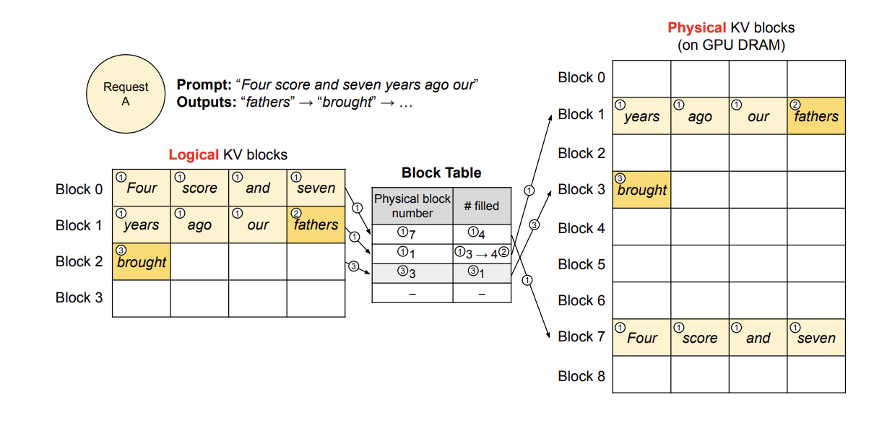
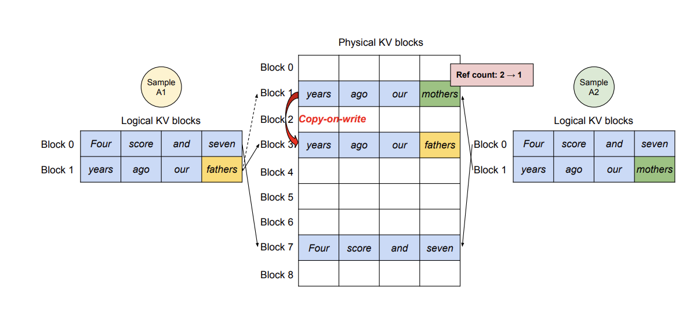
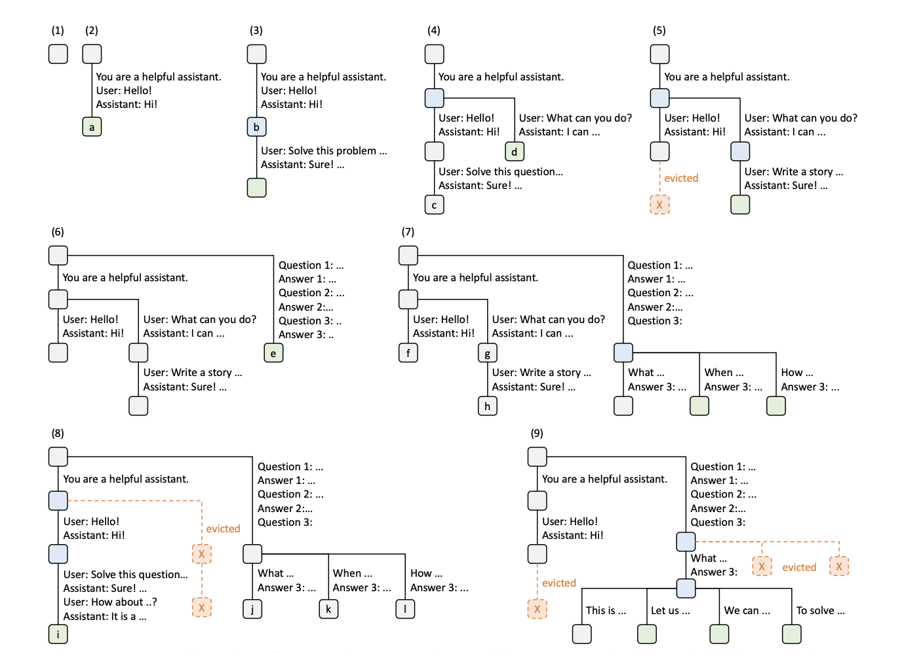

1. 大模型paading
```Text
大多数的 LLM 训练都没有使用 padding（通过将多个训练样本拼成模型的最大长度 context length，可以提升训练效率。假如模型的最大长度为 8，句子的长度为 4，如果使用 padding，则只能训练一个句子，不使用 padding 的话则可以训练两个句子），所以通常不会提供 pad_token，但在推理时，如果不设置 pad_token，则会报错。
```
2. vLLM
   1. Paged Attention
   ```Text
   LLM在进行推理时由于不知道生成序列的长度，通常模型会过度分配内存，这些内存可能不会被使用，导致内存碎片化。
   ```
   解决方案：
   ```Text
   通过paged attention，分配一个逻辑上连续的kv block，通过block table对于逻辑上的kv block进行翻译后得到虚拟block以实现在不连续的内存空间上分配kv cache的存储。
   并且通过共享内存，对于beam search等解码算法进行速度优化。
   ```
   block翻译表：
   

    并行采样：
    

   一些参数
   ```Text
   max_model_len: 上下文文本长度，由模型本身决定，推理时会预分配显存来存储kv cache。
   tensor_parallel_size: 
   ```
3. SGLang
   1. Prefill-Decode Disaggregation
   ```Text
   它将计算密集的“预填充”（处理提示）阶段与访存密集的“解码”（逐词生成）阶段彻底分开，让它们可以独立调度运行。
   Prefill: 处理prompt（request）的时候可以对于多个prompts并行处理，充分利用gpu的并行特点；属于计算密集型。
   Decode： 自回归生成每一个token，读取kv cacahe，属于内存密集型。
   ```
   2. Radix Attention
   ```Text
   基于prefix tree实现kv cache计算的共享，提升了多轮对话的效率。
   ```
    

    3. Cache-aware scheduling policy
    ```Text
    对于消息分配的优化。
    ```
    4. Constrained decoding
    ```Text
    处理特定格式的时候用于mask一些不可能的token。
    ```
