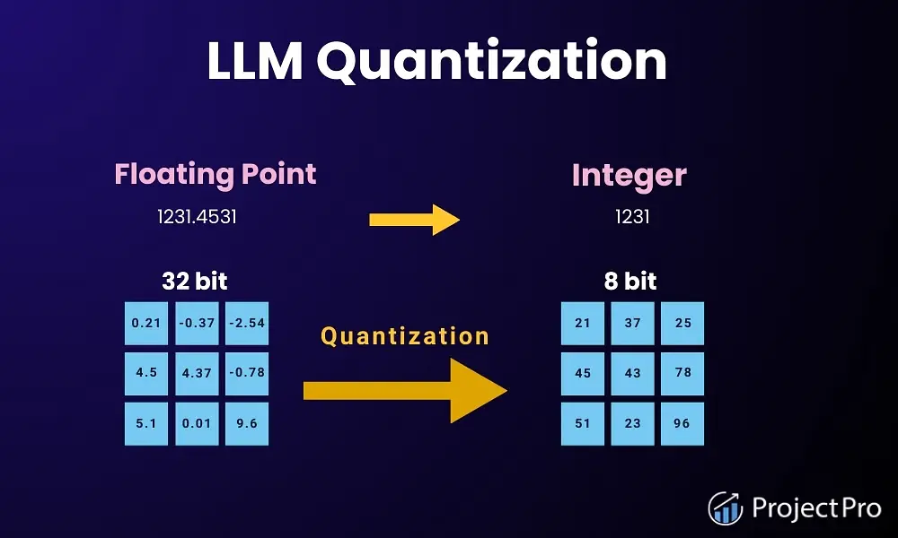
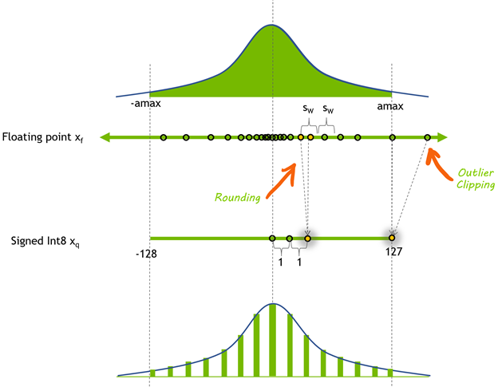
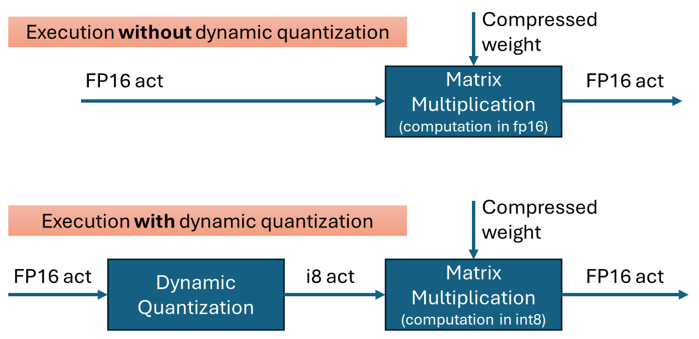
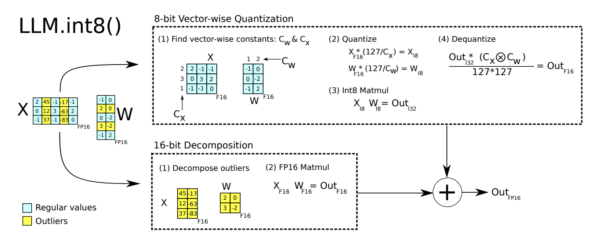
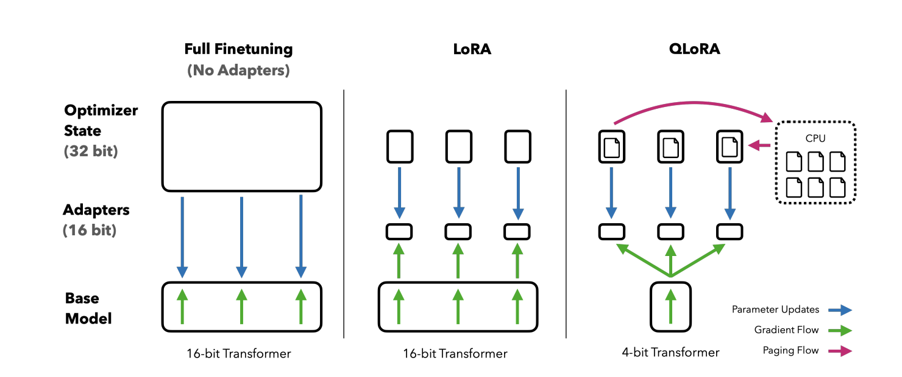

# 大模型量化

1. 为什么需要量化？
```Text
计算过程中TensorCore和显存之间存在频繁数据交换。如果能减少数据交换的大小，便可以提升模型的推理速率。
量化就是把Float类型（FP32，FP16）的模型参数和激活值，用整数（Int8，Int4）来代替。同时尽可能减少量化后模型推理所带来的误差。
```
2. 量化带来的好处有？
```Text
减少模型的存储空间和显存的占用。
减少显存和TensorCore之间的数据传输，从而加快模型推理时间。
显卡对于整数运算的速度快于浮点型数据，从而加快模型推理时间。
```
3. 对称量化

```Text
将浮点数映射到signed INT8的范围（-127， 127）；浮点数的取值范围，在经过量化后，仍旧以0为中心对称。
公式：
scale = 127/max(abs(x))
x_q = Clip(Round(x_f*scale), q_min, q_max)

Dequantization:
x_f' = x_q / scale
```
4. 非对称量化
```Text
非对称量化允许浮点数的原始取值范围 [Rmin,Rmax] 直接映射到整数的取值范围 [Imin,Imax]，而无需保持对称。对于8位整数（INT8），其无符号取值范围通常是 [0,255]。

公式：
scale = (max(x_f) - min(x_f)) / (q_max - q_min)
zero_point = q_min - round(min(x_f) / scale)
x_q = Clip(Round(x_f / scale + zero_point), q_min, q_max)

Dequantization:
x_f' = (x_q - zero_point) * scale
```
5. 为什么量化对神经网络精度影响不大？
```Text
1. 权重和输入都经过normalization，fanweibuda。
2. 因为激活函数，数值影响会被平滑。
3. 神经网络进行预测是是相对数值。
```
6. 动态量化

```Text
缺点：
1. 每次推理时都要对输入值进行量化参数的计算，消耗时间。
2. 每层计算玩都需要转化为fp32，占用较多显存带宽。
```
7. 静态量化
```Text
利用有代表性的数据提前对每一层模型的激活值进行量化。
在每层输入输出时进行量化的操作。
```
8. 量化感知训练
```Text
在模型训练过程中插入一节伪量化节点以提升模型对于量化的鲁棒性。
```
9.  LLM.int8量化

```Text
将矩阵分解为两部分进行计算，以解决emergent feature出现的问题。
模型推理速度变慢。
```
1.  QLoRA

```Text
在进行LoRA微调时，对模型参数进行量化以节省显存。借助模型参数的正态分布对对参数进行分块4bit量化。
注意前向和反向传播：当计算时，需要将4-bit的基础模型权重动态地反量化为 BFloat16 精度，然后与同样是 BFloat16 的 LoRA 模块权重一起进行计算。
```