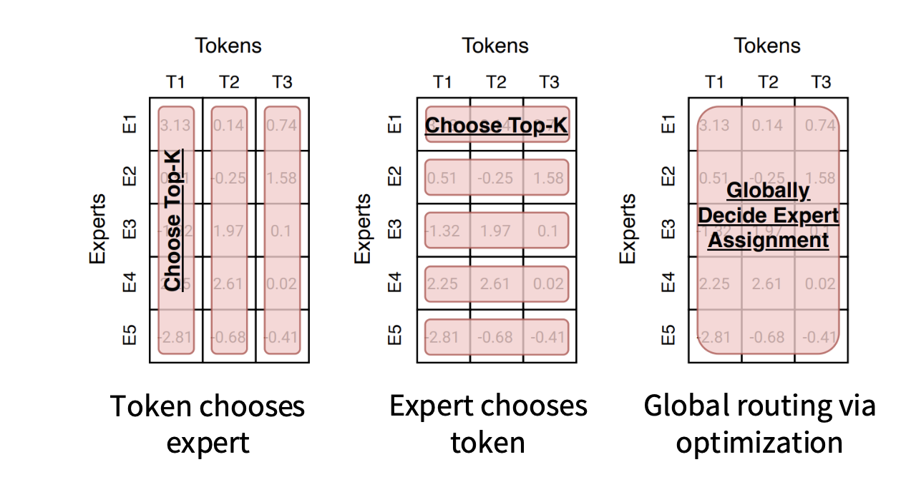
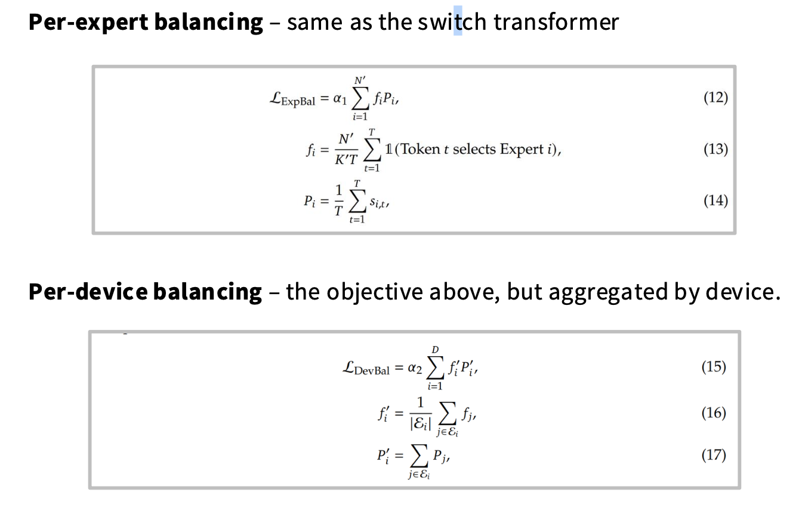
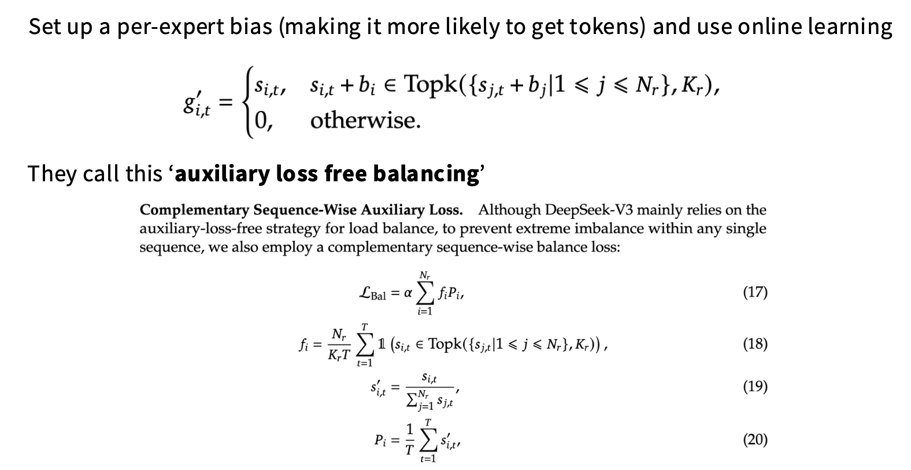

# MoE

## 路由函数

```Text
Token选择expert的方法试验表现好于expert choose token。
```
## MoE路由方法
1. Top-k Routing
   ```Text
   1. 对每个输入计算每个专家的得分（通常用一个小的 gating 网络）。
   2. 选出前 k 个专家。
   3. 输入只送到这 k 个专家，输出加权求和。
   ```
   1. Noisy Top-k Routing（缓解输出/负载不均衡）
   ```Text
   1. gating 输出加噪声（如高斯噪声）。
   2. 选出 top-k 专家。
   ```
2. Soft Routing（计算成本较高）
   ```Text
   1. Gating 网络输出概率分布[p1,...,pn]。
   2. 每个专家的输出按概率加权。
   ```
3. Hash-based Routing （速度快， 灵活性较差）
   ```Text
   输入根据 hash 算法固定路由到某个专家或几个专家。
   ```
4. Learned/Dynamic Routing（计算成本较高）
   ```Text
   通过训练动态选择专家
   ```

## MoE Codes
```Python
# 主要参考自 mistral MOE 的实现

class MOERouter(nn.Module):
    def __init__(self, hidden_dim, expert_number, top_k):
        super().__init__()
        self.gate = nn.Linear(hidden_dim, expert_number)
        self.expert_number = expert_number
        self.top_k = top_k
    
    def forward(self, hidden_states):
        # 计算路由logits
        router_logits = self.gate(hidden_states)  # shape is (b * s, expert_number)
        
        # 计算专家经过softmax之后的概率
        routing_probs = F.softmax(router_logits, dim=-1, dtype=torch.float)
        
        # 计算topk的专家的输出
        router_weights, selected_experts = torch.topk(
            routing_probs, self.top_k, dim=-1
        )  # shape都是 (b * s, top_k)
        
        # 专家权重归一化
        router_weights = router_weights / router_weights.sum(dim=-1, keepdim=True)
        router_weights = router_weights.to(hidden_states.dtype)
        
        # 生成专家掩码
        expert_mask = F.one_hot(
            selected_experts,
            num_classes=self.expert_number
        )  # shape是 (b * s, top_k, expert_number)
        expert_mask = expert_mask.permute(2, 1, 0)  # (expert_number, top_k, b * s)
        
        return router_logits, router_weights, selected_experts, expert_mask


class MOEConfig:
    def __init__(
            self, 
            hidden_dim, 
            expert_number, 
            top_k, 
            shared_experts_number=2,
        ):
        self.hidden_dim = hidden_dim
        self.expert_number = expert_number
        self.top_k = top_k
        self.shared_experts_number = shared_experts_number

class SparseMOE(nn.Module):
    # 稀疏 MOE 模型，这里每一个 token 都会过 topk 个专家，得到对应token 的 hidden_embeddings
    def __init__(self, config):
        super().__init__()

        self.hidden_dim = config.hidden_dim

        self.expert_number = config.expert_number
        self.top_k = config.top_k

        self.experts = nn.ModuleList(
            [
                BasicExpert(self.hidden_dim, self.hidden_dim) for _ in range(self.expert_number)
            ]
        )

        self.router = MOERouter(self.hidden_dim, self.expert_number, self.top_k)
    
    def forward(self, x):
        # x shape is (b, s, hidden_dim)
        batch_size, seq_len, hidden_dim = x.size()

        # 合并前两个维度，因为不是 Sample 维度了，而是 token 维度
        hidden_states = x.view(-1, hidden_dim) # shape is(b * s, hidden_dim)

        router_logits, router_weights, selected_experts_indices, expert_mask = self.router(hidden_states)
        # 其中 selected_experts_indices shape 是 (b * s, top_k)
        # 其中 expert_mask shape 是 (expert_number, top_k, b * s)
        
        final_hidden_states = torch.zeros(
            (batch_size * seq_len, hidden_dim),
            dtype=hidden_states.dtype,
            device=hidden_states.device
        )

        for expert_idx in range(self.expert_number):
            expert_layer = self.experts[expert_idx]
            # expert_mask[expert_idx] shape 是 (top_k, b * s)
            top_idx, token_idx = torch.where(expert_mask[expert_idx]) 
            # top_idx 和 token_idx 都是一维 tensor
            # top_idx 的值是 0 或 1, 表示这个 token 是作为当前专家的 top1 还是 top2
            # token_idx 的值是 token 在 batch*seq_len 中的位置索引
            # 例如对于 batch_size=2, seq_len=4 的输入:
            # token_idx 的值范围是 0-7, 表示在展平后的 8 个 token 中的位置
            # top_idx 的值是 0/1, 表示这个 token 把当前专家作为其 top1/top2 专家

            # hidden_states 的 shape 是 (b * s, hidden_dim)
            # 需要取到 token_idx 对应的 hidden_states
            current_state = hidden_states.unsqueeze(
                0
            )[:, token_idx, :].reshape(-1, hidden_dim) # （selected_token_number, hidden_dim）

            # router_weight 的 shape 是 (b * s, top_k)
            current_hidden_states = expert_layer(
                current_state
            ) * router_weights[token_idx, top_idx].unsqueeze(-1)  # （selected_token_number, 1） 这里有广播

            # 把当前专家的输出加到 final_hidden_states 中
            # 方式1 的写法性能更好，并且方式1容易出现
            final_hidden_states.index_add_(0, token_idx, current_hidden_states.to(hidden_states.dtype))
            # 方式2
            # final_hidden_states[token_idx] += current_hidden_states.to(hidden_states.dtype)
            # 方式1 的写法性能更差，并且方式1容易出现错误，+= 操作在处理重复索引时需要多次读写内存，可能会导致竞争条件

        # 把 final_hidden_states 还原到原来的 shape
        final_hidden_states = final_hidden_states.reshape(batch_size, seq_len, hidden_dim)

        return final_hidden_states, router_logits # shape 是 (b * s, expert_number)


def test_token_level_moe():
    x = torch.rand(2, 4, 16)
    config = MOEConfig(16, 2, 2)
    token_level_moe = SparseMOE(config)
    out = token_level_moe(x)
    print(out[0].shape, out[1].shape)


test_token_level_moe()
```

## 负载均衡

1. 辅助损失
    ```Text
    在训练过程中引入辅助损失，用于平衡各部分任务或样本的贡献，避免模型过度偏向某些特定数据或特征。
    ```


2. deepseek v3 负载均衡