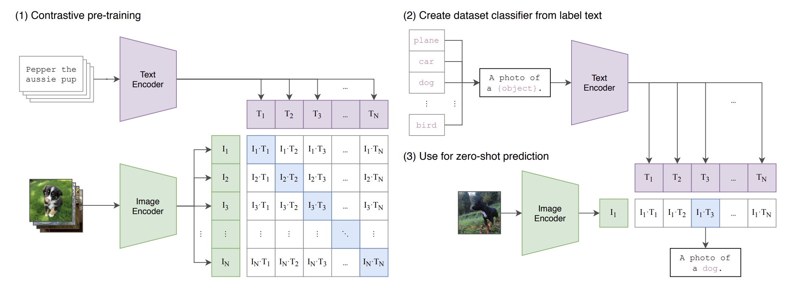
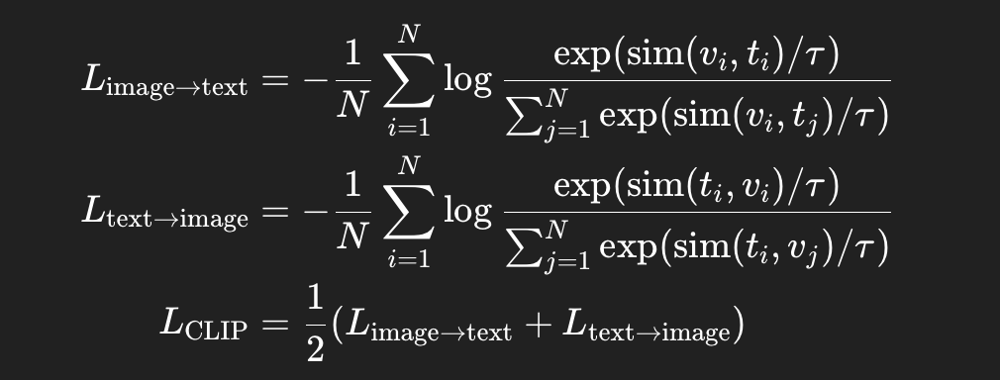

# Vision Language Model
1. CLIP

```Text
CLIP 是一个通过对比学习让图像与文本在同一向量空间中对齐的多模态模型，使它能“看图识词、以词找图”。
```
clip使用了对称infoNCE loss:

 
 Clip的模型选择：
 ```Text
 image encoder: ResNet or Vision Transformer
 text encoder: CBOW or Text Transformer
 ```