1. Action-Value Function
   ```Text
    在状态 s 下采取动作 a，并此后遵循策略 pi 时所能获得的期望回报。通常用Q来表示。
   ```
1. State-Value Function
    ```Text
    在状态s遵循策略pi时所能获得的期望回报。通常用V来表示。
    ```
1. Advantage Function
   ```Text
   在某个状态下，某个特定的动作到底有多好。
   通常用A来表示；A = Q(a, s)-V(s)
   ```
2.  马尔可夫决策过程
   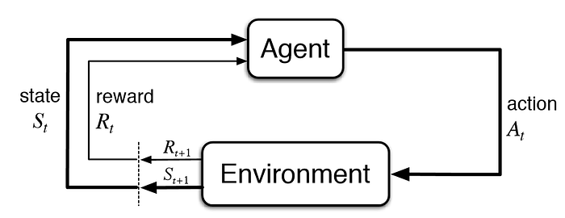
   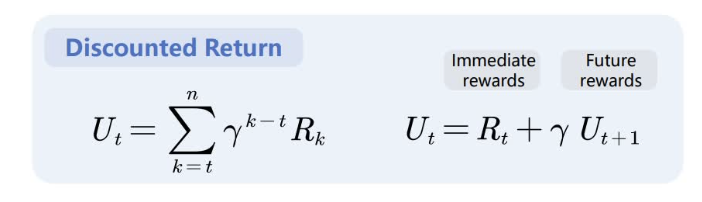
   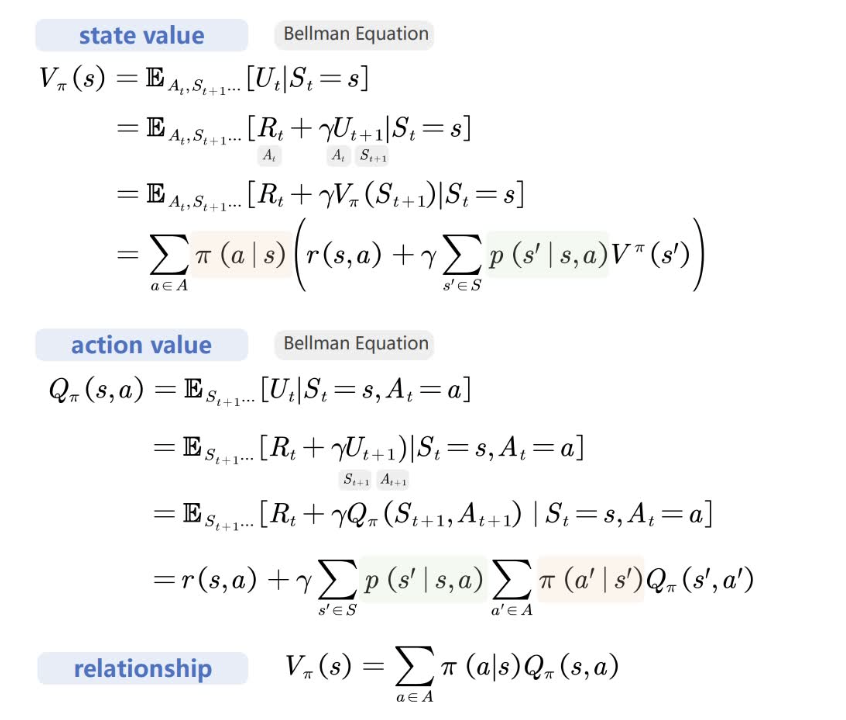
    ```Text
    state value is the expectation of action value
    ```

3. value-based
    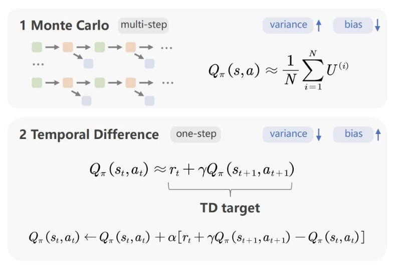
     1. Monte Carlo:
        ```Text
        对整条链路进行估计，方差较大，偏差（bias）较小
        ```
    1. Temporal Difference
        ```Text
        用“一步之后的预测”减去“当前预测”，用这个差值来更新当前预测。
        对一步进行估计，方差较小，偏差较大
        ```
4. On-Policy vs Off-Policy
   ```Text
   On-Policy: 学习的agent和环境互动的agent是相同的一个
   Off-Policy: 学习的agent和环境互动的agent是不同的
   ```
5. SARSA
    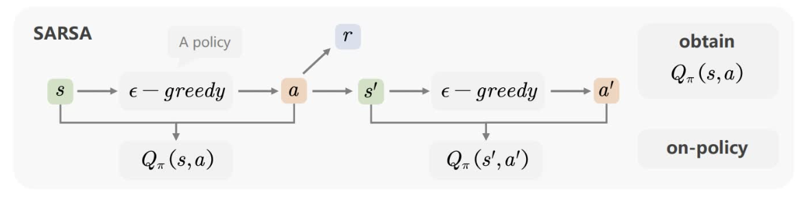
    ```Text
    On-Policy; 获取 Q(s,a)
    ```

6. QLearning
    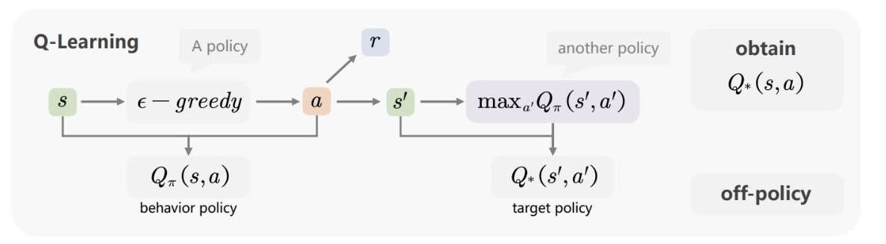
    ```Text
    Off-Policy; 获取 最优Q(s,a)
    ```
7. Policy Gradient
   ```Text
    PPO (Proximal Policy Optimization) 的核心要点：
   目标：
   直接优化策略，在保证学习稳定的同时提高样本效率。

   策略更新：
   使用剪切的目标函数，约束新旧策略的差异，避免一次更新过大。

   价值函数：
   同时训练一个价值网络 V(s)，作为 baseline 来降低方差，
   也用来计算优势函数。

   优势函数：
   常用 GAE 方法来估计，能够在偏差和方差之间取得平衡。

   损失函数组合：
   总损失 = 策略损失 + 价值损失 + 熵奖励，
   策略保证收敛，价值提供稳定，熵增加探索。

   训练方式：
   - 多个 epoch，mini-batch 随机采样更新
   - 策略与价值网络通常共享前向层
   - 使用学习率调度与梯度裁剪保证稳定

   ```
8. Importance Sampling
   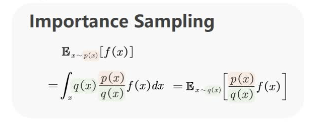
   ```Text
   重要性采样是一种方法：在难以直接从目标分布采样时，通过从易采样的分布取样并用权重 p(x)/q(x)修正，来估计目标分布下的期望。
   ```
9.  Generalized Advantage Estimation (GAE):
   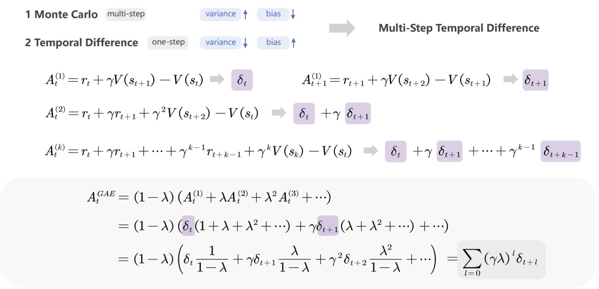
   ```Text
   GAE 是一种在强化学习中通过引入折扣因子 λ，将多步 TD 误差加权平均，从而在优势函数估计中平衡偏差与方差的技巧。
   ```
10. TRPO
    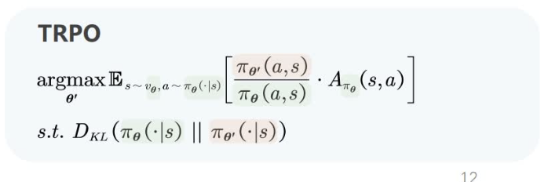
11. PPO 
    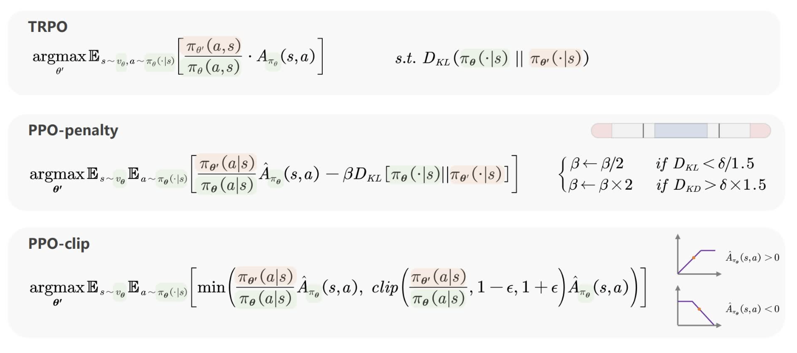
12. GRPO
    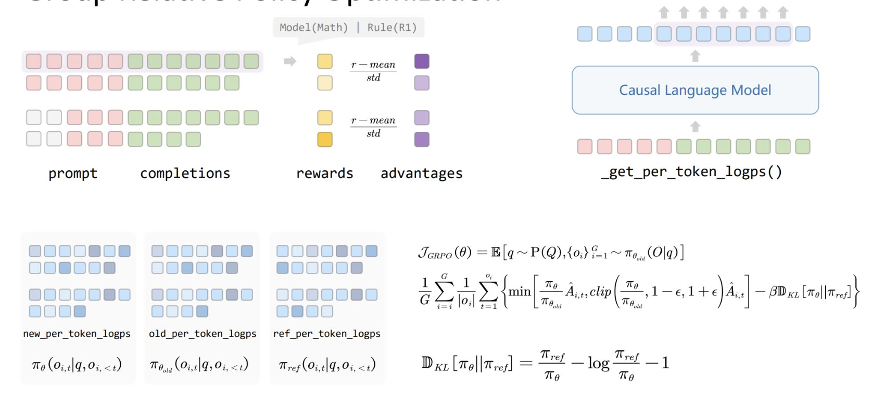
13. PPO VS GRPO
    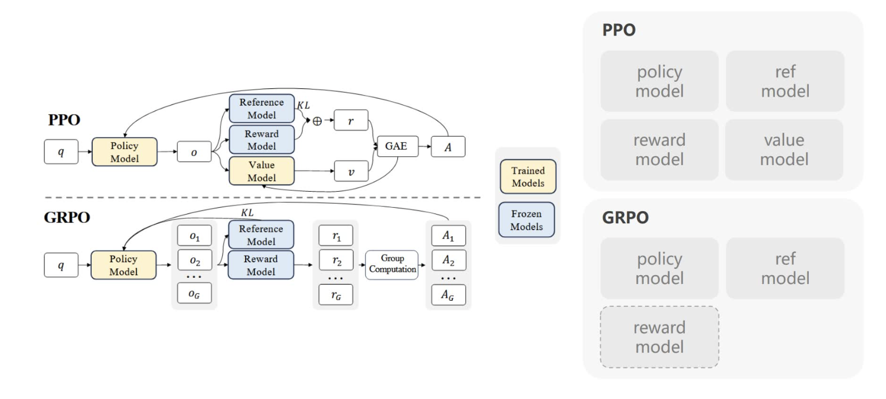

```text
KL 在 PPO vs GRPO 中的作用对比：

1. PPO 中的 KL
   - 参考分布：旧策略 π_old
   - 作用：限制每次更新幅度，防止训练过程不稳定
   - 本质：近端约束（保证和“上一步的自己”接近）

2. GRPO 中的 KL
   - 参考分布：参考模型 π_ref（通常是 SFT 模型）
   - 作用：限制策略偏离参考模型过远，避免模式坍塌
   - 本质：正则约束（保证和“老师”接近）

总结：
- PPO 的 KL → 控制单步更新的稳定性
- GRPO 的 KL → 保持整体策略与参考模型一致性
```


14. DPO
   
DPO's Loss
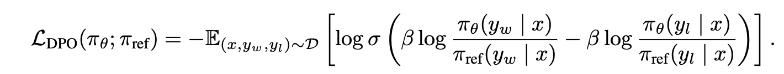

What the gradient update of DPO is doing?
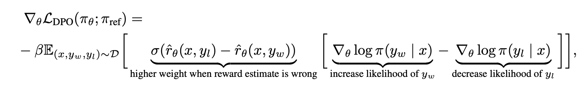

15. DAPO
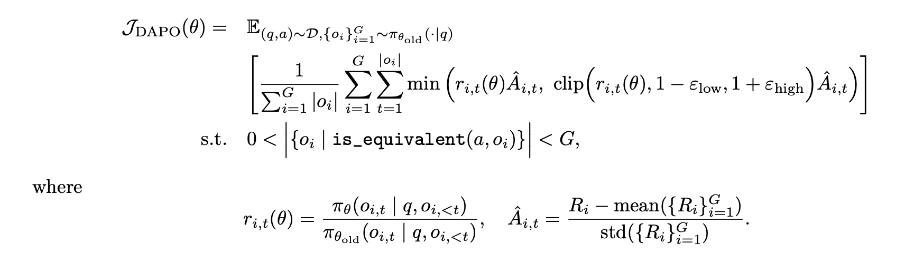
```Text
解决的问题
1. Clip Higher:解决熵坍塌的问题
2. Dynamic Sampling: 解决训练稳定性
3. Token-level Policy Gradient Loss: 解决长推理链
4. Overlong Reward Shaping: 减少奖励噪音和稳定训练
```
```Text
创新方法
1. 去除KL散度的限制：长cot下模型(actor model)的分布可以和最初的模型(reference model)有大的差异
2. Clip higher: 参数上下界不一样，解决低概率token的概率的提升不显著的问题。使模型不会失去探索能力。
3. dynamic sampling: 采样的batch中既不能没有正确答案，也不能全是正确答案。0 < I(sample correct) < Group Size
```
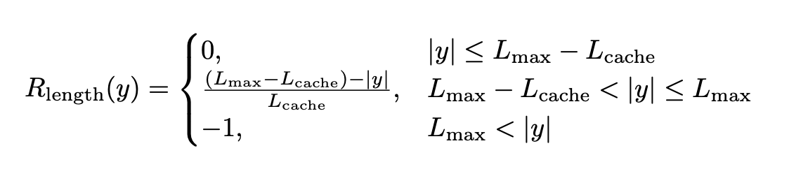
```Text
4. Soft Overlong Punishment: 奖励函数中惩罚过长的回答。
```


16. GSPO
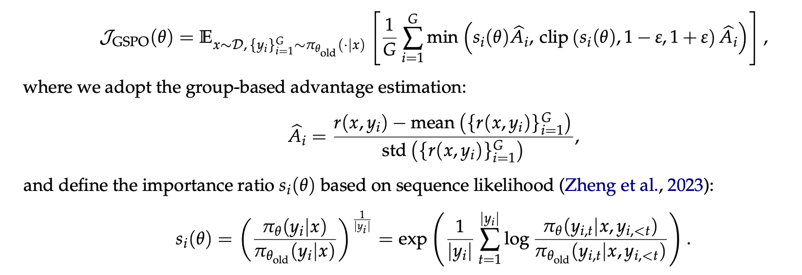

```Text
1. 句子，序列层面上的梯度。
```
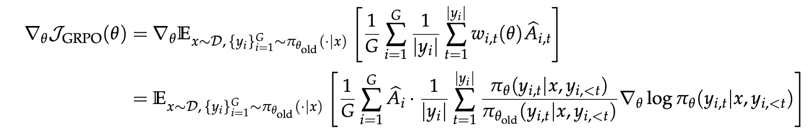
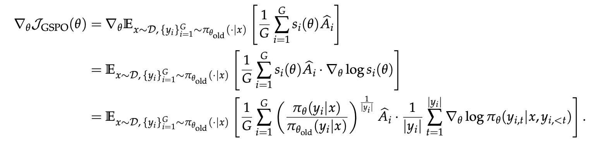

```Text
2. 引入了句子长度归一化。
3. 引入了裁剪，裁剪过长的回答。
4. Routing Replay: 解决GRPO在moe训练不稳定的问题
```

