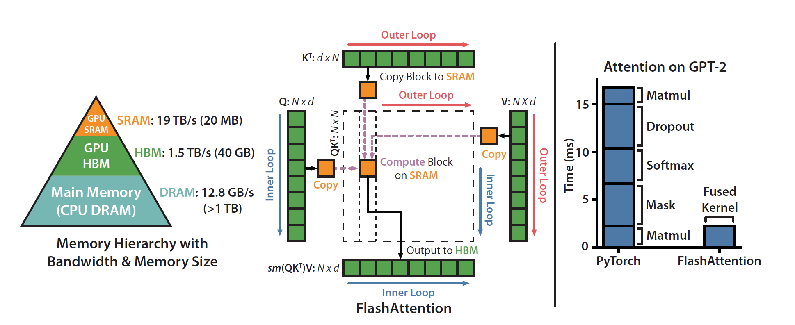

## Some Basic Concepts
1. Reduce Memory Access
2. Move memory to shared memory
3. Trade memory for computation/accuracy
4. Flash Attention

```Text
避免注意力矩阵从HBM中的读写，减少io量。
- 通过分块计算，融合多个操作如：online softmax（加或减去全局最大值）， safe softmax（防止softmax结果过大溢出），减少中间结果缓存。
- 反向传播时重新计算中间结果。
```
1. Flash Attention V2
