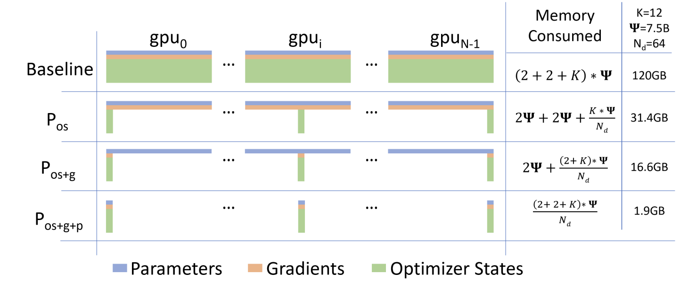

# Deepspeed Zero

1. Deepspeed第一阶段
   ```Text
   ZeRO-Stage 1：划分优化器状态（Pos）
    核心操作： 将优化器状态（如Adam的动量和方差）划分到所有GPU上，每个GPU只存储和更新其对应的部分。
    内存节省： 约4倍的内存减少。
    通信开销： 与标准数据并行（DDP）相同，性能开销很小。
    适用场景： 当模型权重和梯度可以放入单个GPU内存，但优化器状态导致内存溢出时（中大型模型）。
   ```
2. Deepspeed第二阶段
   ```Text
   ZeRO-Stage 2：划分优化器状态 + 划分梯度（Pos + Pg）
    核心操作： 在第一阶段的基础上，进一步将梯度也划分到所有GPU上，每个GPU只保留与其拥有的优化器状态部分相对应的梯度。
    内存节省： 约8倍的内存减少。
    通信开销： 与标准数据并行（DDP）相同，无需额外的通信开销。
    适用场景： 提供性能和内存效率的最佳平衡。适用于大型模型，进一步释放内存以增大批量大小或使用更大的模型。
   ```
3. Deepspeed第三阶段
   ```Text
   ZeRO-Stage 3：划分优化器状态 + 划分梯度 + 划分模型参数（Pos + Pg + Pp）
    核心操作： 在前两阶段的基础上，模型参数（权重）也被划分到所有GPU上。在计算需要时，参数会自动从拥有它的GPU上聚合（All-Gather）到当前GPU，使用后随即释放。
    内存节省： 理论上能达到线性扩展（N倍，其中N是GPU数量），能够训练数百亿甚至万亿参数的模型。
    通信开销： 会引入额外的通信开销（参数的All-Gather）。
    适用场景： 训练超大规模模型（如参数量过大以至于单个GPU无法容纳模型本身）的必备阶段，也支持大型模型推理。
   ```