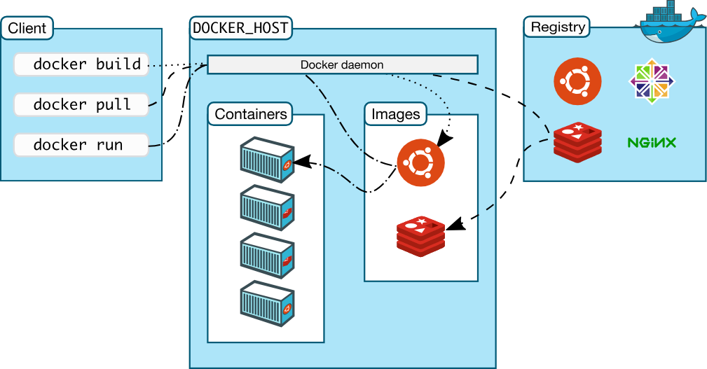

# Docker

```Text
轻量级的容器平台
把应用及其依赖一起打包、分发并在任意环境一致运行。
```



## 核心概念

1. Image（镜像）

   ```Text
   只读模板，分层构成；由 Dockerfile 构建，用 tag 标记版本。
   ```
2. Container（容器）

   ```Text
   镜像的运行实例；进程隔离，共享宿主机内核，可启动/停止/删除。
   ```
3. Dockerfile

   ```Text
   构建镜像的脚本；常用：FROM、RUN、COPY、ENV、EXPOSE、CMD、ENTRYPOINT。
   ```
4. Registry（镜像仓库）

   ```Text
   存放/分发镜像（Docker Hub 或私有）；按 repository:tag 管理版本。
   ```
5. Docker Engine（dockerd）

   ```Text
   守护进程；负责构建、运行、拉取、推送；对外提供 REST API。
   ```
6. Docker CLI

   ```Text
   命令行客户端；常用：docker build/run/push/pull/compose 等。
   ```
7. Layer（分层/联合文件系统）

   ```Text
   镜像由多层只读层组成；容器叠加可写层；层可复用，节省空间与时间。
   ```
8. Volume（数据卷）

   ```Text
   数据持久化与共享；支持匿名卷、命名卷、绑定挂载（映射宿主目录）。
   ```
9. Network（网络）

   ```Text
   提供连通与隔离；常见驱动：bridge、host、none；支持端口映射。
   ```
10. Compose

    ```Text
    用 YAML 定义多容器应用（services/volumes/networks）；一键启动开发/测试栈。
    ```
