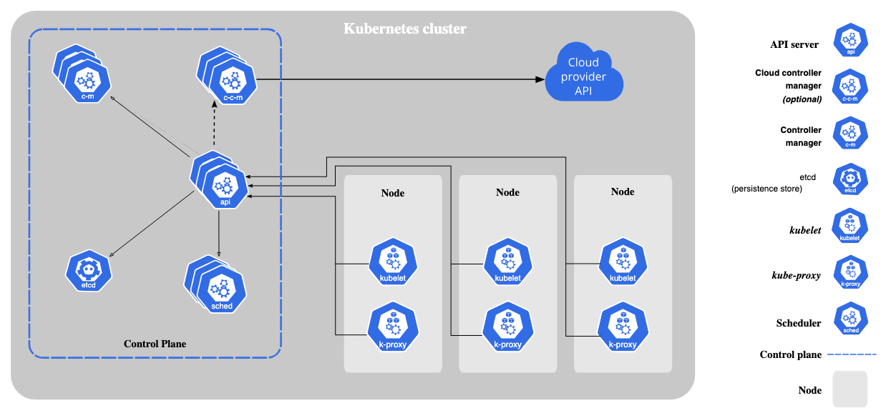

# Kubernetes
```Text
自动化部署，管理和扩展容器化的应用。
```

 ## 核心概念
 1. Pod
    ```Text
    Kubernetes 中最小的部署单位。
    每个 Pod 封装一个或多个共享网络和存储资源的容器（通常是一个）。
    当容器崩溃时，K8s 会自动重启或重新调度新的 Pod。
    ```
 2. Node
    ```Text
    运行 Pod 的机器（可以是物理机或虚拟机）。
    分为两种：
        Master Node（控制节点）：负责调度、管理和监控。
        Worker Node（工作节点）：实际运行应用容器。
    ```
 3. Cluster
    ```Text
    多个节点（Master + Worker）的集合。
    提供高可用性、负载均衡、自动恢复等能力。
    ```
 4. Deployment
    ```Text
    管理一组 Pod 的声明式方式。
    处理某个或某些pods挂掉的情况。
    允许滚动更新、回滚、自动扩缩容等。
    ```
 5. Service（规则）
    ```Text
    定义一组 Pod 的访问策略（如负载均衡、内部 DNS 名称）。
    为一组pod提供虚拟ip和端口
    使外部或内部客户端可以通过固定 IP 或域名访问应用。
    ```
 6. Namespace
    ```Text
    用于在集群中划分逻辑隔离空间。
    ```
7. Volume
   ```Text
   容器的文件系统是临时的。为了让容器的数据不会随着容器的销毁而丢失，并在多个容器之间共享文件。
   ```
8. Ingress
   ```Text
    集群外部层（http/https）：
    Ingress 是一种 API 对象，用来定义 HTTP(S) 请求如何从集群**外部路由到集群内部**的服务。
    它本身不直接处理流量，而是配合一个实际的 Ingress Controller 一起工作。
   ```
---
## Node内部组件
1. Kubelet
   ```Text
   每个节点上的“代理”，确保容器按预期运行。
   保证它所管辖的所有pods健康运行。
   ```
2. Kube-proxy
   ```Text
   集群内部层（tcp/upd)：
   管理网络通信，实现服务负载均衡。
   ```
3. Container Runtime
   ```Text
   实际运行容器的底层软件，如 Docker、containerd。
   ```
## 控制组件
1. kube-apiserver
    ```Text
    集群的“入口”，所有命令和通信都通过它。
    ```
2. ectd
   ```Text
   保存集群的所有配置和状态，是分布式键值数据库。
   ```
3. kube-scheduler
   ```Text
   监控集群中所有节点的资源使用情况。
   决定 Pod 应该运行在哪个节点上。
   ```
4. kube-controller-manager
   ```Text
   监控检测节点故障并处理故障。
   负责自动化控制逻辑（如副本数保持、节点状态检测等）。
   ```
5. cloud-controller-manager
    ```Text
    能自动管理云端资源，如节点、路由、负载均衡、存储卷等。
    ```