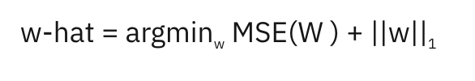

# Machine Learning - List of questions

## Learning Theory

1. Describe bias and variance with examples. 
    #### Bias
    Bias is the error due to overly simplistic assumptions in the learning algorithm. High bias can cause the model to miss the relevant relations between features and target outputs (underfitting), meaning the model is not complex enough to capture the underlying patterns of the data.
    #### High Bias Example in Machine Learning
    Imagine you are using a linear regression model to predict housing prices based on features such as square footage and the number of bedrooms. However, the relationship between these features and the price is actually non-linear. By assuming a linear relationship, your model is too simple to capture the complexities of the real-world function that determines housing prices, leading to systematic errors in predictions.
    #### Variance
    Variance refers to the error due to too much complexity in the learning algorithm. High variance can cause the model to model the random noise in the training data (overfitting), meaning the model learns patterns from the training data that don't generalize to unseen data.
    #### High Variance Example in Machine Learning
    Consider a decision tree model that you've allowed to grow without constraints until each leaf node represents only one training example. Such a model might perform perfectly on the training set, capturing every detail (including noise) in the dataset. However, this complexity makes the model highly sensitive to the specifics of the training data, and it is likely to perform poorly on new, unseen data because it has learned the noise as if it were a real pattern.

1. What is Empirical Risk Minimization?
    ### Empirical Risk Minimization (ERM)

    Empirical Risk Minimization (ERM) is a fundamental principle in statistical learning and machine learning that aims at minimizing the loss (or error) on the training dataset to identify the best model. The essence of ERM is to select the model or model parameters that reduce the empirical risk, essentially the average loss over the training samples.

    ### How Does ERM Work?

    The empirical risk is calculated by applying a loss function to the model's predictions on the training data and then averaging these losses. The loss function measures the discrepancy between the predicted and actual values. For regression tasks, mean squared error is a common loss function, and for classification tasks, cross-entropy loss is often used.

    ERM's goal is to find the model parameters that minimize this empirical risk. However, minimizing empirical risk directly can lead to overfitting, especially if the model is too complex, perfectly fitting the training data, including its noise. This happens because ERM focuses solely on the training data, neglecting how the model performs on unseen data.

    ### Mathematical Formulation

    Given a dataset $\(\{(x_1, y_1), (x_2, y_2), ..., (x_n, y_n)\}\) where \(x_i\)$ represents the input features and $\(y_i\)$ are the labels, and a model $\(f\)$ parameterized by $\(\theta\)$, the empirical risk $\(R_{emp}(\theta)\)$ is defined as:

    $$\[R_{emp}(\theta) = \frac{1}{n} \sum_{i=1}^{n} L(f(x_i; \theta), y_i)\]$$

    Here, $\(L\)$ is the loss function, $\(n\)$ is the number of samples in the training dataset, $\(f(x_i; \theta)\)$ denotes the model's prediction for input $\(x_i\)$, and $\(y_i\)$ are the true labels.

    ### Example

    Consider a linear regression problem where the goal is to predict a person's weight based on their height. The model is a linear function $\(f(x) = mx + b\)$, with $\(x\)$ representing height, $\(m\)$ and $\(b\)$ as parameters to be learned, and $\(f(x)\)$ as the predicted weight. Using mean squared error for the loss function, ERM will determine the values of $\(m\)$ and $\(b\)$ that minimize the average squared difference between the predicted and actual weights in the training dataset.

    ### Challenges and Solutions

    While ERM is a potent principle, direct application can result in overfitting, particularly with complex models and limited data. To mitigate this, several approaches are employed, such as regularization (adding a penalty to the loss to discourage complexity) and validation methods (dividing the data into training and validation sets to gauge model performance on unseen data).

    ERM underpins many machine learning algorithms, guiding the optimization process towards models that exhibit good performance on the provided data.

1. Write the formula for training error and generalization error. Point out the differences.

    In the context of machine learning, understanding the difference between training error and generalization error is crucial for developing models that not only perform well on the data they were trained on but also generalize well to unseen data.

    ### Training Error

    **Definition:** Training error, also known as empirical error, is the average error that the model makes on the training dataset. It measures how well the model fits the data it was trained on.

    **Formula:**

    $$\[ \text{Training Error} = \frac{1}{N} \sum_{i=1}^{N} L(y_i, \hat{y}_i) \]$$

    - $\(N\)$ is the number of training samples.
    - $\(y_i\)$ is the actual label of the ith sample.
    - $\(\hat{y}_i\)$ is the predicted label of the ith sample.
    - $\(L\)$ is the loss function that measures the discrepancy between the actual and predicted labels.

    ### Generalization Error

    **Definition:** Generalization error, also known as out-of-sample error, is the expected error of the model on new, unseen data. It measures how well the learned model generalizes to data outside the training set.

    **Formula:**

    $$\[ \text{Generalization Error} = E[L(Y, \hat{Y})] \]$$

    - $\(E\)$ denotes the expected value over the distribution of the data.
    - $\(Y\)$ is the actual label of a new sample.
    - $\(\hat{Y}\)$ is the predicted label of a new sample.
    - $\(L\)$ is the loss function.

    ### Differences

    1. **Measurement Basis:** Training error is calculated on the same data the model was trained on, while generalization error is concerned with the model's performance on new, unseen data.

    2. **Optimization:** Models are typically trained by minimizing the training error, but minimizing training error too much can lead to overfitting, where the model learns the noise in the training data rather than the underlying distribution. This usually increases the generalization error.

    3. **Accessibility:** Training error can be directly calculated during the training process. In contrast, the true generalization error is often impractical to calculate because it requires the true distribution of the data, so it is usually estimated using techniques like cross-validation.

    The goal in machine learning is to develop a model that achieves a low generalization error, indicating that it has learned the underlying patterns well enough to make accurate predictions on unseen data.

1. State the uniform convergence theorem and derive it.

    ## Uniform Convergence Theorem

    The Uniform Convergence Theorem is a key concept in statistical learning theory. It states that, under certain conditions, the empirical risk (the average loss over the training set) of all functions in a hypothesis space will converge uniformly to their true risk (the expected loss over the entire data distribution) as the sample size increases. This convergence provides theoretical assurance that a model trained on a sufficiently large dataset will have similar performance on unseen data, assuming the data are drawn from the same distribution.

    ### Formula

    For any $\(\epsilon > 0\)$ and $\(\delta > 0\)$, there exists a sample size $\(m\)$ such that for all functions $\(f\)$ in a hypothesis space $\(H\)$, the following holds with probability at least $\(1 - \delta\)$:

   $$\[P\left(\sup_{f \in H} |E_{(x,y) \sim D}[L(f(x), y)] - \frac{1}{m}\sum_{i=1}^m L(f(x_i), y_i)| < \epsilon\right) \geq 1 - \delta\]$$

    Where:
    - $\(E_{(x,y) \sim D}\)$ denotes the expectation over the data distribution $\(D\)$,
    - $\(L(f(x), y)\)$ is the loss of predicting $\(f(x)\)$ when the true label is $\(y\)$,
    - $\(x_i, y_i\)$ are the samples drawn from $\(D\)$,
    - $\(m\)$ is the sample size,
    - $\(\sup\)$ denotes the supremum, indicating the worst-case deviation across all functions in the hypothesis space.

<!-- 1. What is sample complexity bound of uniform convergence theorem?  -->
<!-- 1. What is error bound of uniform convergence theorem?  -->
1. Can you derive bias-variance decomposition?
    
<!-- 1. From the bias-variance trade-off, can you derive the bound on training set size? -->
1. What is the VC dimension?
    - [Link to explanation](https://datascience.stackexchange.com/questions/32557/what-is-the-exact-definition-of-vc-dimension)

<!-- 1. What does the training set size depend on for a finite and infinite hypothesis set? Compare and contrast.  -->
1. What is the VC dimension for an n-dimensional linear classifier? 
    - n + 1

<!-- 1. Considering that Empirical Risk Minimization is a NP-hard problem, how does logistic regression and SVM loss work?  -->

# Basic Models
## Linear Regression
### Formulation
$$y = \beta_0 + \beta_1x + \epsilon$$
where:
- $y$ is the dependent variable (the variable we are trying to predict),
- $x$ is the independent variable (the variable used to make predictions),
- $\beta_0$ is the intercept (the value of $y$ when $x$ is 0),
- $\beta_1$ is the slope coefficient (it represents the change in $y$ for a one-unit change in $x$),
- $\epsilon$ is the error term (the difference between the observed values and the values predicted by the model).
  
Objective function:
$$\text{Minimize} \quad S = \sum_{i=1}^n (y_i - (\beta_0 + \beta_1x_i))^2$$
where,
- $n$ is the number of observations
- $y_i$ and $x_i$ are the observed values of the dependent and independent variables
- $S$ is the sum of the squared differences (also known as the residual sum of squares).
  

1. Can you explain the difference between simple and multiple linear regression?
   - Simple linear regression models the relationship between two variables, making it straightforward but limited in handling real-world complexity. Multiple linear regression handles multiple influences simultaneously, offering a more nuanced understanding of the factors that affect the dependent variable.
2. How are the coefficients in a linear regression model estimated? What method is commonly used for this purpose?
    - Closed form solution: $\beta = (X^T X)^{-1} X^T y$
<!-- 3. What is the formula for the least squares estimator in linear regression? -->
4. What are the key assumptions made by linear regression models?
    ### 1. Linearity
   - **Summary:** The relationship between the predictors and the outcome is assumed to be linear.

   ### 2. Independence of Errors
   - **Summary:** The residuals (errors) are expected to be independent from each other.

   ### 3. Homoscedasticity
   - **Summary:** The variance of the residuals should be constant across all levels of the independent variables.

   ### 4. Normality of Errors
   - **Summary:** For purposes of inference, the residuals should follow a normal distribution.

   ### 5. No Perfect Multicollinearity
   - **Summary:** The independent variables should not be perfectly correlated with each other.

   ### 6. Exogeneity of Independent Variables
   - **Summary:** The predictors must not be correlated with the error terms to avoid biased estimates.
<!-- 1. How does the assumption of homoscedasticity affect a linear regression model? -->
<!-- 2. How can linear regression be adapted to model non-linear relationships? -->
   
3. What is multicollinearity and why is it a problem for linear regression?
   - Multicollinearity in linear regression occurs when two or more predictors are highly correlated, making it difficult to isolate the individual effect of each predictor. This condition can lead to unstable estimates of coefficients, inflated standard errors, and thus unreliable statistical tests. 
     
4. How to resolve multicollinearity?
    - To address multicollinearity, methods such as removing correlated predictors, combining them into a single variable, or applying regularization techniques like ridge regression are often used.
### Ridge Regression
#### Definition
Ridge regression—also known as L2 regularization—is one of several types of regularization for linear regression models.
$$\text{minimize} \quad J(\boldsymbol{\beta}) = (\mathbf{y} - \mathbf{X}\boldsymbol{\beta})^T (\mathbf{y} - \mathbf{X}\boldsymbol{\beta}) + \lambda \boldsymbol{\beta}^T \boldsymbol{\beta}$$
where:

- $(\mathbf{y} - \mathbf{X}\boldsymbol{\beta})^T (\mathbf{y} - \mathbf{X}\boldsymbol{\beta})$ is the residual sum of squares (RSS),
- $\lambda$ is a non-negative regularization parameter that controls the amount of shrinkage: the larger the value of $\lambda$, the greater the amount of shrinkage
- $\lambda \boldsymbol{\beta}^T \boldsymbol{\beta}$ is the regularization term that penalizes the magnitude of the coefficients.

L2 penalty shrinks coefficients towards zero but never to absolute zero; although model feature weights may become negligibly small, they never equal zero in ridge regression. 
### Lasso Regression
#### Definition
Lasso regression—also known as L1 regularization—is a form of regularization for linear regression models

L1 regularization works by reducing coefficients to zero, essentially eliminating those independent variables from the model. Both lasso regression and ridge regression thus reduce model complexity
## Logistic Regression
Logistic regression is used for predicting the probability of a binary outcome, based on one or more predictor variables. The model applies the logistic function to a linear combination of predictors to predict the probability that the dependent variable equals a certain category.

### Logistic Function
The sigmoid function is defined as:
$$\sigma(z) = \frac{1}{1 + e^{-z}}$$

### Model formulation
The logistic regression model can be expressed as:
$$P(Y = 1 | X) = \sigma(\beta_0 + \beta_1 X_1 + \beta_2 X_2 + \dots + \beta_n X_n)$$
where $\beta_0, \beta_1, \beta_2, \ldots, \beta_n$ are coefficients.

### Log-likelihood function
$$\ell(\beta) = \sum_{i=1}^N \left[ Y_i \log(\sigma(X_i^T \beta)) + (1 - Y_i) \log(1 - \sigma(X_i^T \beta)) \right]$$

### Log odds
$$\log \left(\frac{P(Y = 1 | X)}{1 - P(Y = 1 | X)}\right) = \beta_0 + \beta_1 X_1 + \beta_2 X_2 + \dots + \beta_n X_n$$

### Related questions

## Support Vector Machine

### Definition
SVM works by finding the hyperplane that best divides a dataset into two classes of data points. The aim is to select a hyperplane with the greatest possible margin between support vectors in the two respective classes. Support vectors are the data points nearest to the hyperplane; the position and orientation of the hyperplane are determined based on these points.
### Formulation
The basic idea is to solve the following optimization problem:

$$\[ \min_{\mathbf{w}, b} \frac{1}{2} \|\|\mathbf{w}\|\|^2 \]$$

Subject to the constraints (for each labeled example $\((\mathbf{x}_i, y_i)\)$):

$$\[ y_i (\mathbf{w} \cdot \mathbf{x}_i + b) \geq 1 \]$$

Here:
- $\( \mathbf{w} \)$ is the weight vector perpendicular to the hyperplane.
- $\( b \)$ is the bias term, which shifts the hyperplane away from the origin.
- $\( \mathbf{x}_i \)$ represents the feature vectors.
- $\( y_i \)$ are the labels associated with each feature vector, typically \(1\) or \(-1\) in a binary classification.

<!-- 1. How can the SVM optimization function be derived from the logistic regression optimization function?
1. What is a large margin classifier?
1. Why SVM is an example of a large margin classifier?
1. SVM being a large margin classifier, is it influenced by outliers? (Yes, if C is large, otherwise not) -->
1. What is the role of C in SVM?
   The objective in soft margin SVM includes a term for slack variables, making the formulation:
$$\min_{w, b} \frac{1}{2} \|w\|^2 + C \sum_{i=1}^{n} \max(0, 1 - y_i (w \cdot x_i + b))$$
where:

- \( w \) is the weight vector.
- \( b \) is the bias term.
- \( C \) is the regularization parameter.
- \( n \) is the number of training examples.
- \( y_i \) is the true label of the \( i \)-th training example.
- \( x_i \) is the feature vector of the \( i \)-th training example.

### Impact of $\( C \)$
- **High $\( C \)$ Value**: Prioritizes fewer misclassifications (low bias but potentially high variance), leading to a narrower margin and possibly overfitting.
- **Low $\( C \)$ Value**: More misclassifications are tolerated (higher bias but lower variance), leading to a wider margin and potentially better generalization.

### Choosing $\( C \)$
The selection of $\( C \)$ is crucial for the performance of the SVM classifier:
- It is typically determined through model selection methods such as cross-validation, where $\( C \)$ is varied to observe the effect on performance metrics like accuracy, precision, and recall.
- A balance needs to be struck between the complexity of the model and its performance on unseen data, which often involves domain knowledge and experimental tuning.
  

<!-- 1. In SVM, what is the angle between the decision boundary and theta? -->
<!-- 2. What is the mathematical intuition of a large margin classifier? -->
3. What is a kernel in SVM? Why do we use kernels in SVM?
- A kernel in Support Vector Machines (SVM) is a function that enables SVMs to classify non-linearly separable data by implicitly mapping it into a higher-dimensional space. This process, known as the "kernel trick," avoids the computationally expensive task of direct transformations. Kernels, such as linear, polynomial, radial basis function (RBF), and sigmoid, enhance SVM's versatility, allowing it to handle complex patterns and feature interactions effectively, thus broadening its applicability in solving varied classification and regression challenges in machine learning.
- Example of a kernel trick (polynomial):
    $$K(x, y) = (1 + x \cdot y)^2$$
    $K(x, y) = (1 + x_1 y_1 + x_2 y_2)^2
        = 1 + 2x_1 y_1 + 2x_2 y_2 + x_1^2 y_1^2 + 2x_1 y_1 x_2 y_2 + x_2^2 y_2^2$\
        \
    $\phi(x) = [1, \sqrt{2}x_1, \sqrt{2}x_2, x_1^2, \sqrt{2}x_1 x_2, x_2^2]$
1. Explain why does RBF kernel maps to infinite dimensions
- Radial based kernel (RBF) mapping to infinity dimension explanation:
  $$e^{\frac{1}{2}(a-b)^2} = e^{\frac{1}{2}(a^2 + b^2 - 2ab)} = e^{-\frac{1}{2}(a^2 + b ^2)}\cdot e^{ab}$$
  then create the Taylor expansion of $e^{ab}$,
  $$e^{ab} = 1 + \frac{1}{1!}ab + \frac{1}{2!}(ab)^2 + \frac{1}{3!}(ab)^3+\cdots +\frac{1}{\infty!}(ab)^{\infty}$$
  then convert this to dot product,
  $$e^{ab} = (1, \sqrt{\frac{1}{1!}}a, \sqrt{\frac{1}{2!}}(a)^2, \sqrt{\frac{1}{3!}}(a)^3,\cdots,\sqrt{\frac{1}{\infty!}}(a)^{\infty})\cdot \\(1, \sqrt{\frac{1}{1!}}b, \sqrt{\frac{1}{2!}}(b)^2, \sqrt{\frac{1}{3!}}(b)^3,\cdots,\sqrt{\frac{1}{\infty!}}(b)^{\infty})\ \ (3)$$ 
  then we have
  $$e^{\frac{1}{2}(a-b)^2} = e^{-\frac{1}{2}(a^2 + b ^2)} \cdot [(3)]\\
  =  (S, S\sqrt{\frac{1}{1!}}a, S\sqrt{\frac{1}{2!}}(a)^2, S\sqrt{\frac{1}{3!}}(a)^3,\cdots,S\sqrt{\frac{1}{\infty!}}(a)^{\infty})\cdot \\(S, S\sqrt{\frac{1}{1!}}b, S\sqrt{\frac{1}{2!}}(b)^2, S\sqrt{\frac{1}{3!}}(b)^3,\cdots,S\sqrt{\frac{1}{\infty!}}(b)^{\infty})\ \ $$
  where $S = \sqrt{e^{-\frac{1}{2}(a^2 + b ^2)}}$
1. How do you choose the right parameters (C and gamma) for an SVM model? What impact do they have on the model?
   - Gamma defines how far the influence of a single training example reaches, with low values meaning ‘far’ and high values meaning ‘close’. The gamma parameter interacts with the RBF kernel and affects the curvature of the decision boundary. A large gamma value leads to a decision boundary that closely fits around the training data, which can be too wavy, potentially capturing noise and outliers (overfitting). A small gamma value results in a more linear decision boundary.
   - The parameter C acts as a regularization parameter in an SVM. A small value of C makes the decision surface smooth and simple, with a higher tolerance for misclassifications (higher bias and lower variance). A large C aims for a lower error on the training data, potentially at the cost of simplicity, leading to a decision surface that tries hard to classify all training examples correctly (lower bias and higher variance).
2. In what situations would you prefer to use SVM over other classification algorithms like logistic regression or decision trees?
   - SVMs are particularly effective in high-dimensional spaces, where the number of features is greater than the number of samples.
   - If the decision boundaries are highly non-linear, SVM with appropriate kernel functions (like RBF) can model complex interactions between features much better than logistic regression, which typically assumes linear boundaries unless explicitly extended with polynomial or interaction terms.
   - SVMs are effective when a clear margin of separation is needed. They not only focus on classifying training examples correctly but also on maximizing the decision margin, which can lead to better generalization capabilities on unseen data compared to decision trees, which might overfit more easily.
   - suitable for binary classification
   - Can control outliers (C)
   - Handle sparse data well. **Reason**: SVMs make their classification decision based only on a subset of the training data, known as the support vectors. This means that the SVM model does not need to use all the data features but focuses only on those that are most informative for defining the decision boundary. In sparse datasets, where most features for most samples are zero, this characteristic significantly reduces the complexity and computational burden, as irrelevant features (those typically at zero) don't impact the model.
1. Can SVMs be used for multi-class classification? If so, explain how that is typically handled.
   - ### 1. One-vs-One (OvO) Approach:
   - **How It Works**: In this method, a binary SVM model is trained for every pair of classes. For a problem with \( N \) classes, this results in \( \frac{N(N-1)}{2} \) classifiers. Each classifier distinguishes between a pair of classes.
   - **Decision Making**: During prediction, every classifier votes for a class, and the class with the most votes is selected as the final prediction.
   - **Advantages**: This method is effective because each classifier only needs to learn to distinguish between two classes, which can simplify the learning problem.
   - **Drawbacks**: The number of classifiers grows quadratically with the number of classes, which can lead to increased computational cost and complexity when dealing with a large number of classes.

   - ### 2. One-vs-All (OvA) or One-vs-Rest (OvR) Approach:
   - **How It Works**: In this approach, one SVM model is trained per class to distinguish the samples of that class from the samples of all other classes. For \( N \) classes, \( N \) classifiers are trained.
   - **Decision Making**: Each classifier produces a confidence score that indicates the likelihood of an input belonging to its class. The classifier with the highest confidence score determines the class label.
   - **Advantages**: The computational complexity is lower compared to the OvO method since only \( N \) classifiers are needed, making it more scalable.
   - **Drawbacks**: The classifiers may be biased towards the majority class in imbalanced datasets because each classifier is trained against samples from all other classes.

4. Dual SVM derivation
## Primal Problem
The primal form of the Support Vector Machine (SVM) optimization problem is given by:

$$ \min_{\mathbf{w}, b, \xi} \frac{1}{2} \|\mathbf{w}\|^2 + C \sum_{i=1}^n \xi_i $$

subject to:

$$
\begin{aligned}
    &y_i (\mathbf{w}^\top \mathbf{x}_i + b) \geq 1 - \xi_i, \quad \forall i \\
    &\xi_i \geq 0, \quad \forall i
\end{aligned}
$$

where:
- $\mathbf{w}$ is the weight vector.
- $b$ is the bias term.
- $\xi_i$ are the slack variables.
- $C$ is the regularization parameter.
- $(\mathbf{x}_i, y_i)$ are the training samples.

## Lagrangian
To derive the dual form, we start by writing the Lagrangian for the primal problem. Introduce the Lagrange multipliers $\alpha_i \geq 0$ for the inequality constraints $y_i (\mathbf{w}^\top \mathbf{x}_i + b) \geq 1 - \xi_i$ and $\mu_i \geq 0$ for the non-negativity constraints $\xi_i \geq 0$:

$$
\mathcal{L}(\mathbf{w}, b, \xi, \alpha, \mu) = \frac{1}{2} \|\mathbf{w}\|^2 + C \sum_{i=1}^n \xi_i - \sum_{i=1}^n \alpha_i \left[ y_i (\mathbf{w}^\top \mathbf{x}_i + b) - 1 + \xi_i \right] - \sum_{i=1}^n \mu_i \xi_i
$$

## Dual Problem
To find the dual problem, we need to minimize the Lagrangian with respect to the primal variables $\mathbf{w}$, $b$, and $\xi$.

### Minimization with Respect to $\mathbf{w}$
Set the gradient of $\mathcal{L}$ with respect to $\mathbf{w}$ to zero:

$$
\frac{\partial \mathcal{L}}{\partial \mathbf{w}} = \mathbf{w} - \sum_{i=1}^n \alpha_i y_i \mathbf{x}_i = 0
$$

Thus,

$$
\mathbf{w} = \sum_{i=1}^n \alpha_i y_i \mathbf{x}_i
$$

### Minimization with Respect to $b$
Set the gradient of $\mathcal{L}$ with respect to $b$ to zero:

$$
\frac{\partial \mathcal{L}}{\partial b} = - \sum_{i=1}^n \alpha_i y_i = 0
$$

Thus,

$$
\sum_{i=1}^n \alpha_i y_i = 0
$$

### Minimization with Respect to $\xi_i$
Set the gradient of $\mathcal{L}$ with respect to $\xi_i$ to zero:

$$
\frac{\partial \mathcal{L}}{\partial \xi_i} = C - \alpha_i - \mu_i = 0
$$

Since $\mu_i \geq 0$, we get:

$$
\alpha_i \leq C
$$

### Substituting Back
Substitute $\mathbf{w} = \sum_{i=1}^n \alpha_i y_i \mathbf{x}_i$ back into the Lagrangian, we get:

$$
\mathcal{L}(\alpha) = \sum_{i=1}^n \alpha_i - \frac{1}{2} \sum_{i=1}^n \sum_{j=1}^n \alpha_i \alpha_j y_i y_j \mathbf{x}_i^\top \mathbf{x}_j
$$

The dual problem is then:

$$
\max_{\alpha} \sum_{i=1}^n \alpha_i - \frac{1}{2} \sum_{i=1}^n \sum_{j=1}^n \alpha_i \alpha_j y_i y_j \mathbf{x}_i^\top \mathbf{x}_j
$$

subject to:

$$
\begin{aligned}
    &\sum_{i=1}^n \alpha_i y_i = 0 \\
    &0 \leq \alpha_i \leq C, \quad \forall i
\end{aligned}
$$

This is the dual form of the SVM optimization problem.

<!-- 2. How are the landmarks initially chosen in an SVM? How many and where?
1. Can we apply the kernel trick to logistic regression? Why is it not used in practice then?
2. What is the difference between logistic regression and SVM without a kernel? (Only in implementation – one is much more efficient and has good optimization packages)
3.  How does the SVM parameter C affect the bias/variance trade off? (Remember C = 1/lambda; lambda increases means variance decreases)
4.  How does the SVM kernel parameter sigma^2 affect the bias/variance trade off?
5.  Can any similarity function be used for SVM? (No, have to satisfy Mercer’s theorem) -->
<!-- 7.  Logistic regression vs. SVMs: When to use which one? 
( Let's say n and m are the number of features and training samples respectively. If n is large relative to m use log. Reg. or SVM with linear kernel, If n is small and m is intermediate, SVM with Gaussian kernel, If n is small and m is massive, Create or add more fetaures then use log. Reg. or SVM without a kernel) -->
<!-- 1. How is the VC dimension of a SVM bounded although it is projected to an infinite dimension?  -->

1. What are the differences between “Bayesian” and “Freqentist” approach for Machine Learning?

### Bayesian Approach
- **Probability Interpretation**: Degree of belief, updated with new data.
- **Parameters**: Treated as random variables with prior distributions.
- **Inference**: Based on the posterior distribution using Bayes' theorem.
- **Prediction**: Averages over the posterior distribution, incorporating parameter uncertainty.
- **Model Comparison**: Uses Bayes factors and incorporates prior information.
- **Uncertainty**: Naturally handled through posterior distributions.
- **Computation**: Often more computationally intensive (e.g., MCMC methods).

### Frequentist Approach
- **Probability Interpretation**: Long-run frequency of events.
- **Parameters**: Treated as fixed but unknown quantities.
- **Inference**: Based on sampling distributions, using methods like MLE.
- **Prediction**: Uses point estimates of parameters.
- **Model Comparison**: Uses criteria like likelihood ratio tests, AIC, or BIC.
- **Uncertainty**: Quantified through confidence intervals and p-values.
- **Computation**: Typically less computationally intensive.

### Practical Considerations
- **Bayesian**: Incorporates prior knowledge and provides richer information about uncertainty but can be computationally demanding.
- **Frequentist**: Simpler to implement, computationally efficient, but may not handle prior information or uncertainty as effectively.
<!-- 3. Compare and contrast maximum likelihood and maximum a posteriori estimation.
4. How does Bayesian methods do automatic feature selection?
5. What do you mean by Bayesian regularization?
6. When will you use Bayesian methods instead of Frequentist methods? (Small dataset, large feature set) -->

## Naive Bayes
# Naive Bayes Classifier

## Definition
The Naive Bayes classifier is a probabilistic machine learning model used for classification tasks. It is based on Bayes' theorem, with the "naive" assumption that the features are conditionally independent given the class label. Despite this simplification, Naive Bayes often performs well in practice, especially for text classification problems such as spam detection and sentiment analysis.

## Formulation

### Bayes' Theorem
Bayes' theorem provides the foundation for the Naive Bayes classifier. It relates the conditional and marginal probabilities of random events:

$$
P(C \mid X) = \frac{P(X \mid C) \cdot P(C)}{P(X)}
$$

where:
- $P(C \mid X)$ is the posterior probability of class $C$ given the feature vector $X$.
- $P(X \mid C)$ is the likelihood of feature vector $X$ given class $C$.
- $P(C)$ is the prior probability of class $C$.
- $P(X)$ is the marginal probability of the feature vector $X$.

### Naive Bayes Assumption
The Naive Bayes classifier assumes that the features are conditionally independent given the class label. This simplifies the likelihood $P(X \mid C)$ as follows:

$$
P(X \mid C) = \prod_{i=1}^n P(X_i \mid C)
$$

where $X_i$ is the $i$-th feature in the feature vector $X$.

### Posterior Probability
Using the Naive Bayes assumption, the posterior probability $P(C \mid X)$ can be expressed as:

$$
P(C \mid X) \propto P(C) \cdot \prod_{i=1}^n P(X_i \mid C)
$$

where $\propto$ denotes proportionality, as $P(X)$ is constant for all classes and can be omitted for the purpose of classification.

### Classification Rule
The Naive Bayes classifier assigns a class label $\hat{C}$ to the feature vector $X$ by choosing the class with the highest posterior probability:

$$
\hat{C} = \arg\max_{C} P(C) \cdot \prod_{i=1}^n P(X_i \mid C)
$$

### Types of Naive Bayes Classifiers
There are several variants of the Naive Bayes classifier depending on the assumptions made about the distribution of the features:
- **Gaussian Naive Bayes**: Assumes that the features follow a Gaussian (normal) distribution.
- **Multinomial Naive Bayes**: Assumes that the features follow a multinomial distribution, commonly used for discrete data like word counts in text classification.
- **Bernoulli Naive Bayes**: Assumes that the features are binary-valued (0 or 1).

### Example (Gaussian Naive Bayes)
For Gaussian Naive Bayes, the likelihood $P(X_i \mid C)$ is given by the Gaussian distribution:

$$
P(X_i \mid C) = \frac{1}{\sqrt{2\pi \sigma_{C,i}^2}} \exp \left( -\frac{(X_i - \mu_{C,i})^2}{2\sigma_{C,i}^2} \right)
$$

where $\mu_{C,i}$ and $\sigma_{C,i}$ are the mean and standard deviation of the feature $X_i$ for class $C$.

### Summary
The Naive Bayes classifier is a simple yet effective classification algorithm that leverages the power of Bayes' theorem and the assumption of feature independence. It is computationally efficient and works well for high-dimensional data, making it a popular choice for many real-world applications.

## Some interview questions realted to Naive Bayes

###  Describe a situation where you would prefer to use Naive Bayes over other classification algorithms.
Naive Bayes is particularly useful in scenarios where the features are conditionally independent given the class label, as it simplifies the computation significantly. One such situation is text classification, especially spam detection. In spam detection, each email is represented as a bag of words, and the presence of one word in an email is often independent of the presence of another word given the email's spam or non-spam status. Naive Bayes performs well in this context due to its simplicity, effectiveness, and ability to handle large vocabularies efficiently.

### How does the Naive Bayes classifier perform on high-dimensional data?
Naive Bayes performs well on high-dimensional data due to its assumption of conditional independence, which simplifies the computation of the likelihoods. This makes Naive Bayes computationally efficient and scalable, even with a large number of features. The classifier does not suffer from the curse of dimensionality to the same extent as some other algorithms because it treats each feature independently. However, if the independence assumption is violated, the performance may degrade, although Naive Bayes often still performs reasonably well in practice.

### Can Naive Bayes be used for regression problems? Why or why not?
Naive Bayes is inherently a classification algorithm and is not typically used for regression problems. This is because Naive Bayes models the probability of discrete class labels given the features, while regression involves predicting a continuous output variable. For regression tasks, algorithms like linear regression, polynomial regression, or other regression models are more appropriate. However, there are Bayesian approaches to regression, such as Bayesian linear regression, but these are distinct from the Naive Bayes classifier.

### Give an example of a real-world application where Naive Bayes is particularly effective.
A real-world application where Naive Bayes is particularly effective is in email spam filtering. In spam filtering, emails are classified as either spam or non-spam based on their content. The Naive Bayes classifier is well-suited for this task because the presence or absence of specific words in an email (features) can be used to estimate the probability that an email belongs to the spam class. The independence assumption works reasonably well here because the occurrence of one word is largely independent of another word, given the class label. Naive Bayes classifiers have been successfully used in many spam detection systems due to their simplicity, efficiency, and relatively good performance.

## Clustering
1. Describe the k-means algorithm.
1. What is distortion function? Is it convex or non-convex?
1. Tell me about the convergence of the distortion function.
1. Topic: EM algorithm
1. What is the Gaussian Mixture Model?
1. Describe the EM algorithm intuitively. 
1. What are the two steps of the EM algorithm
1. Compare GMM vs GDA.

## Boosting

## Neural Networks
### CNN
### RNN
1. Describe LSTM

## Model and feature selection
1. Why are model selection methods needed?
1. How do you do a trade-off between bias and variance?
1. What are the different attributes that can be selected by model selection methods?
1. Why is cross-validation required?
1. Describe different cross-validation techniques.
1. What is hold-out cross validation? What are its advantages and disadvantages?
1. What is k-fold cross validation? What are its advantages and disadvantages?
1. What is leave-one-out cross validation? What are its advantages and disadvantages?
1. Why is feature selection required?
1. Describe some feature selection methods.
1. What is forward feature selection method? What are its advantages and disadvantages?
1. What is backward feature selection method? What are its advantages and disadvantages?
1. What is filter feature selection method and describe two of them?
1. What is mutual information and KL divergence?
1. Describe KL divergence intuitively.

## Curse of dimensionality 
1. Describe the curse of dimensionality with examples.
1. What is local constancy or smoothness prior or regularization?

## Universal approximation of neural networks
1. State the universal approximation theorem? What is the technique used to prove that?
1. What is a Borel measurable function?
1. Given the universal approximation theorem, why can't a MLP still reach a arbitrarily small positive error?

## Deep Learning motivation
1. What is the mathematical motivation of Deep Learning as opposed to standard Machine Learning techniques?
1. In standard Machine Learning vs. Deep Learning, how is the order of number of samples related to the order of regions that can be recognized in the function space?
1. What are the reasons for choosing a deep model as opposed to shallow model? (1. Number of regions O(2^k) vs O(k) where k is the number of training examples 2. # linear regions carved out in the function space depends exponentially on the depth. )
1. How Deep Learning tackles the curse of dimensionality? 

## Regularization
1. What is L1 regularization?
1. What is L2 regularization?
1. Compare L1 and L2 regularization.
1. Why does L1 regularization result in sparse models? [here](https://stats.stackexchange.com/questions/45643/why-l1-norm-for-sparse-models)

## Evaluation of Machine Learning systems
1. What are accuracy, sensitivity, specificity, ROC?
1. What are precision and recall?
1. Describe t-test in the context of Machine Learning.

## Dimensionality Reduction
### PCA
1. Why do we need dimensionality reduction techniques? (data compression, speeds up learning algorithm and visualizing data)
1. What do we need PCA and what does it do? (PCA tries to find a lower dimensional surface such the sum of the squared projection error is minimized)
1. What is the difference between logistic regression and PCA?
1. What are the two pre-processing steps that should be applied before doing PCA? (mean normalization and feature scaling)
### t-SNE

## Basics of Natural Language Processing
1. What is WORD2VEC?
1. What is t-SNE? Why do we use PCA instead of t-SNE?
1. What is sampled softmax?
1. Why is it difficult to train a RNN with SGD?
1. How do you tackle the problem of exploding gradients? (By gradient clipping)
1. What is the problem of vanishing gradients? (RNN doesn't tend to remember much things from the past)
1. How do you tackle the problem of vanishing gradients? (By using LSTM)
1. Explain the memory cell of a LSTM. (LSTM allows forgetting of data and using long memory when appropriate.)
1. What type of regularization do one use in LSTM?
1. What is Beam Search?
1. How to automatically caption an image? (CNN + LSTM)

## Machine Learning System Design

## Python

## Miscellaneous
1. What is the difference between loss function, cost function and objective function?
