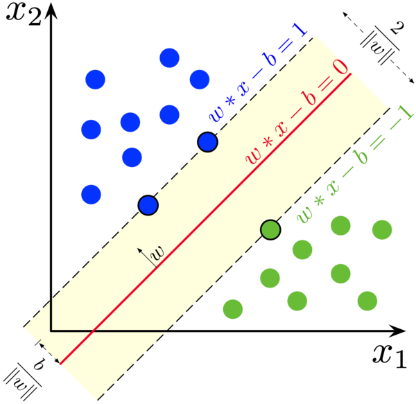

# Machine Learning - List of questions

## Learning Theory

1. Describe bias and variance with examples. 
    #### Bias
    Bias is the error due to overly simplistic assumptions in the learning algorithm. High bias can cause the model to miss the relevant relations between features and target outputs (underfitting), meaning the model is not complex enough to capture the underlying patterns of the data.
    #### High Bias Example in Machine Learning
    Imagine you are using a linear regression model to predict housing prices based on features such as square footage and the number of bedrooms. However, the relationship between these features and the price is actually non-linear. By assuming a linear relationship, your model is too simple to capture the complexities of the real-world function that determines housing prices, leading to systematic errors in predictions.
    #### Variance
    Variance refers to the error due to too much complexity in the learning algorithm. High variance can cause the model to model the random noise in the training data (overfitting), meaning the model learns patterns from the training data that don't generalize to unseen data.
    #### High Variance Example in Machine Learning
    Consider a decision tree model that you've allowed to grow without constraints until each leaf node represents only one training example. Such a model might perform perfectly on the training set, capturing every detail (including noise) in the dataset. However, this complexity makes the model highly sensitive to the specifics of the training data, and it is likely to perform poorly on new, unseen data because it has learned the noise as if it were a real pattern.

1. What is Empirical Risk Minimization?
    ### Empirical Risk Minimization (ERM)

    Empirical Risk Minimization (ERM) is a fundamental principle in statistical learning and machine learning that aims at minimizing the loss (or error) on the training dataset to identify the best model. The essence of ERM is to select the model or model parameters that reduce the empirical risk, essentially the average loss over the training samples.

    ### How Does ERM Work?

    The empirical risk is calculated by applying a loss function to the model's predictions on the training data and then averaging these losses. The loss function measures the discrepancy between the predicted and actual values. For regression tasks, mean squared error is a common loss function, and for classification tasks, cross-entropy loss is often used.

    ERM's goal is to find the model parameters that minimize this empirical risk. However, minimizing empirical risk directly can lead to overfitting, especially if the model is too complex, perfectly fitting the training data, including its noise. This happens because ERM focuses solely on the training data, neglecting how the model performs on unseen data.

    ### Mathematical Formulation

    Given a dataset $\(\{(x_1, y_1), (x_2, y_2), ..., (x_n, y_n)\}\) where \(x_i\)$ represents the input features and $\(y_i\)$ are the labels, and a model $\(f\)$ parameterized by $\(\theta\)$, the empirical risk $\(R_{emp}(\theta)\)$ is defined as:

    $$\[R_{emp}(\theta) = \frac{1}{n} \sum_{i=1}^{n} L(f(x_i; \theta), y_i)\]$$

    Here, $\(L\)$ is the loss function, $\(n\)$ is the number of samples in the training dataset, $\(f(x_i; \theta)\)$ denotes the model's prediction for input $\(x_i\)$, and $\(y_i\)$ are the true labels.

    ### Example

    Consider a linear regression problem where the goal is to predict a person's weight based on their height. The model is a linear function $\(f(x) = mx + b\)$, with $\(x\)$ representing height, $\(m\)$ and $\(b\)$ as parameters to be learned, and $\(f(x)\)$ as the predicted weight. Using mean squared error for the loss function, ERM will determine the values of $\(m\)$ and $\(b\)$ that minimize the average squared difference between the predicted and actual weights in the training dataset.

    ### Challenges and Solutions

    While ERM is a potent principle, direct application can result in overfitting, particularly with complex models and limited data. To mitigate this, several approaches are employed, such as regularization (adding a penalty to the loss to discourage complexity) and validation methods (dividing the data into training and validation sets to gauge model performance on unseen data).

    ERM underpins many machine learning algorithms, guiding the optimization process towards models that exhibit good performance on the provided data.

1. Write the formula for training error and generalization error. Point out the differences.

    In the context of machine learning, understanding the difference between training error and generalization error is crucial for developing models that not only perform well on the data they were trained on but also generalize well to unseen data.

    ### Training Error

    **Definition:** Training error, also known as empirical error, is the average error that the model makes on the training dataset. It measures how well the model fits the data it was trained on.

    **Formula:**

    $$\[ \text{Training Error} = \frac{1}{N} \sum_{i=1}^{N} L(y_i, \hat{y}_i) \]$$

    - $\(N\)$ is the number of training samples.
    - $\(y_i\)$ is the actual label of the ith sample.
    - $\(\hat{y}_i\)$ is the predicted label of the ith sample.
    - $\(L\)$ is the loss function that measures the discrepancy between the actual and predicted labels.

    ### Generalization Error

    **Definition:** Generalization error, also known as out-of-sample error, is the expected error of the model on new, unseen data. It measures how well the learned model generalizes to data outside the training set.

    **Formula:**

    $$\[ \text{Generalization Error} = E[L(Y, \hat{Y})] \]$$

    - $\(E\)$ denotes the expected value over the distribution of the data.
    - $\(Y\)$ is the actual label of a new sample.
    - $\(\hat{Y}\)$ is the predicted label of a new sample.
    - $\(L\)$ is the loss function.

    ### Differences

    1. **Measurement Basis:** Training error is calculated on the same data the model was trained on, while generalization error is concerned with the model's performance on new, unseen data.

    2. **Optimization:** Models are typically trained by minimizing the training error, but minimizing training error too much can lead to overfitting, where the model learns the noise in the training data rather than the underlying distribution. This usually increases the generalization error.

    3. **Accessibility:** Training error can be directly calculated during the training process. In contrast, the true generalization error is often impractical to calculate because it requires the true distribution of the data, so it is usually estimated using techniques like cross-validation.

    The goal in machine learning is to develop a model that achieves a low generalization error, indicating that it has learned the underlying patterns well enough to make accurate predictions on unseen data.

1. State the uniform convergence theorem and derive it.

    ## Uniform Convergence Theorem

    The Uniform Convergence Theorem is a key concept in statistical learning theory. It states that, under certain conditions, the empirical risk (the average loss over the training set) of all functions in a hypothesis space will converge uniformly to their true risk (the expected loss over the entire data distribution) as the sample size increases. This convergence provides theoretical assurance that a model trained on a sufficiently large dataset will have similar performance on unseen data, assuming the data are drawn from the same distribution.

    ### Formula

    For any $\(\epsilon > 0\)$ and $\(\delta > 0\)$, there exists a sample size $\(m\)$ such that for all functions $\(f\)$ in a hypothesis space $\(H\)$, the following holds with probability at least $\(1 - \delta\)$:

   $$\[P\left(\sup_{f \in H} |E_{(x,y) \sim D}[L(f(x), y)] - \frac{1}{m}\sum_{i=1}^m L(f(x_i), y_i)| < \epsilon\right) \geq 1 - \delta\]$$

    Where:
    - $\(E_{(x,y) \sim D}\)$ denotes the expectation over the data distribution $\(D\)$,
    - $\(L(f(x), y)\)$ is the loss of predicting $\(f(x)\)$ when the true label is $\(y\)$,
    - $\(x_i, y_i\)$ are the samples drawn from $\(D\)$,
    - $\(m\)$ is the sample size,
    - $\(\sup\)$ denotes the supremum, indicating the worst-case deviation across all functions in the hypothesis space.

<!-- 1. What is sample complexity bound of uniform convergence theorem?  -->
<!-- 1. What is error bound of uniform convergence theorem?  -->
1. Can you derive bias-variance decomposition?
    
<!-- 1. From the bias-variance trade-off, can you derive the bound on training set size? -->
1. What is the VC dimension?
    - [Link to explanation](https://datascience.stackexchange.com/questions/32557/what-is-the-exact-definition-of-vc-dimension)

<!-- 1. What does the training set size depend on for a finite and infinite hypothesis set? Compare and contrast.  -->
1. What is the VC dimension for an n-dimensional linear classifier? 
    - n + 1

<!-- 1. Considering that Empirical Risk Minimization is a NP-hard problem, how does logistic regression and SVM loss work?  -->

# Basic Models
## Support Vector Machine

### Definition
SVM works by finding the hyperplane that best divides a dataset into two classes of data points. The aim is to select a hyperplane with the greatest possible margin between support vectors in the two respective classes. Support vectors are the data points nearest to the hyperplane; the position and orientation of the hyperplane are determined based on these points.
### Formulation
The basic idea is to solve the following optimization problem:

$$\[ \min_{\mathbf{w}, b} \frac{1}{2} \|\|\mathbf{w}\|\|^2 \]$$

Subject to the constraints (for each labeled example $\((\mathbf{x}_i, y_i)\)$):

$$\[ y_i (\mathbf{w} \cdot \mathbf{x}_i + b) \geq 1 \]$$

Here:
- $\( \mathbf{w} \)$ is the weight vector perpendicular to the hyperplane.
- $\( b \)$ is the bias term, which shifts the hyperplane away from the origin.
- $\( \mathbf{x}_i \)$ represents the feature vectors.
- $\( y_i \)$ are the labels associated with each feature vector, typically \(1\) or \(-1\) in a binary classification.

<!-- 1. How can the SVM optimization function be derived from the logistic regression optimization function?
1. What is a large margin classifier?
1. Why SVM is an example of a large margin classifier?
1. SVM being a large margin classifier, is it influenced by outliers? (Yes, if C is large, otherwise not) -->
1. What is the role of C in SVM?
   The objective in soft margin SVM includes a term for slack variables, making the formulation:
$$\[
\min_{\mathbf{w}, b, \xi} \frac{1}{2} \|\mathbf{w}\|^2 + C \sum_{i=1}^{n} \xi_i
\]
with constraints:
\[
y_i (\mathbf{w} \cdot \mathbf{x}_i + b) \geq 1 - \xi_i \quad \text{and} \quad \xi_i \geq 0 \quad \text{for all } i
\]$$
where $\( \xi_i \)$ measures the misclassification degree of the datum $\( \mathbf{x}_i \)$.

### Impact of $\( C \)$
- **High $\( C \)$ Value**: Prioritizes fewer misclassifications (low bias but potentially high variance), leading to a narrower margin and possibly overfitting.
- **Low $\( C \)$ Value**: More misclassifications are tolerated (higher bias but lower variance), leading to a wider margin and potentially better generalization.

### Choosing $\( C \)$
The selection of $\( C \)$ is crucial for the performance of the SVM classifier:
- It is typically determined through model selection methods such as cross-validation, where $\( C \)$ is varied to observe the effect on performance metrics like accuracy, precision, and recall.
- A balance needs to be struck between the complexity of the model and its performance on unseen data, which often involves domain knowledge and experimental tuning.
  

<!-- 1. In SVM, what is the angle between the decision boundary and theta? -->
<!-- 2. What is the mathematical intuition of a large margin classifier? -->
3. What is a kernel in SVM? Why do we use kernels in SVM?
- A kernel in Support Vector Machines (SVM) is a function that enables SVMs to classify non-linearly separable data by implicitly mapping it into a higher-dimensional space. This process, known as the "kernel trick," avoids the computationally expensive task of direct transformations. Kernels, such as linear, polynomial, radial basis function (RBF), and sigmoid, enhance SVM's versatility, allowing it to handle complex patterns and feature interactions effectively, thus broadening its applicability in solving varied classification and regression challenges in machine learning.
- Example of a kernel trick (polynomial):
    $$K(x, y) = (1 + x \cdot y)^2$$
    $K(x, y) = (1 + x_1 y_1 + x_2 y_2)^2
        = 1 + 2x_1 y_1 + 2x_2 y_2 + x_1^2 y_1^2 + 2x_1 y_1 x_2 y_2 + x_2^2 y_2^2$\
        \
    $\phi(x) = [1, \sqrt{2}x_1, \sqrt{2}x_2, x_1^2, \sqrt{2}x_1 x_2, x_2^2]$
1. Explain why does RBF kernel maps to infinite dimensions
- Radial based kernel (RBF) mapping to infinity dimension explanation:
  $$e^{\frac{1}{2}(a-b)^2} = e^{\frac{1}{2}(a^2 + b^2 - 2ab)} = e^{-\frac{1}{2}(a^2 + b ^2)}\cdot e^{ab}$$
  then create the Taylor expansion of $e^{ab}$,
  $$e^{ab} = 1 + \frac{1}{1!}ab + \frac{1}{2!}(ab)^2 + \frac{1}{3!}(ab)^3+\cdots +\frac{1}{\infty!}(ab)^{\infty}$$
  then convert this to dot product,
  $$e^{ab} = (1, \sqrt{\frac{1}{1!}}a, \sqrt{\frac{1}{2!}}(a)^2, \sqrt{\frac{1}{3!}}(a)^3,\cdots,\sqrt{\frac{1}{\infty!}}(a)^{\infty})\cdot \\(1, \sqrt{\frac{1}{1!}}b, \sqrt{\frac{1}{2!}}(b)^2, \sqrt{\frac{1}{3!}}(b)^3,\cdots,\sqrt{\frac{1}{\infty!}}(b)^{\infty})\ \ (3)$$ 
  then we have
  $$e^{\frac{1}{2}(a-b)^2} = e^{-\frac{1}{2}(a^2 + b ^2)} \cdot [(3)]\\
  =  (S, S\sqrt{\frac{1}{1!}}a, S\sqrt{\frac{1}{2!}}(a)^2, S\sqrt{\frac{1}{3!}}(a)^3,\cdots,S\sqrt{\frac{1}{\infty!}}(a)^{\infty})\cdot \\(S, S\sqrt{\frac{1}{1!}}b, S\sqrt{\frac{1}{2!}}(b)^2, S\sqrt{\frac{1}{3!}}(b)^3,\cdots,S\sqrt{\frac{1}{\infty!}}(b)^{\infty})\ \ $$
  where $S = \sqrt{e^{-\frac{1}{2}(a^2 + b ^2)}}$
1. How are the landmarks initially chosen in an SVM? How many and where?
2. Can we apply the kernel trick to logistic regression? Why is it not used in practice then?
3. What is the difference between logistic regression and SVM without a kernel? (Only in implementation – one is much more efficient and has good optimization packages)
4.  How does the SVM parameter C affect the bias/variance trade off? (Remember C = 1/lambda; lambda increases means variance decreases)
5.  How does the SVM kernel parameter sigma^2 affect the bias/variance trade off?
6.  Can any similarity function be used for SVM? (No, have to satisfy Mercer’s theorem)
7.  Logistic regression vs. SVMs: When to use which one? 
( Let's say n and m are the number of features and training samples respectively. If n is large relative to m use log. Reg. or SVM with linear kernel, If n is small and m is intermediate, SVM with Gaussian kernel, If n is small and m is massive, Create or add more fetaures then use log. Reg. or SVM without a kernel)
1. How is the VC dimension of a SVM bounded although it is projected to an infinite dimension? 

## Bayesian Machine Learning
1. What are the differences between “Bayesian” and “Freqentist” approach for Machine Learning?
1. Compare and contrast maximum likelihood and maximum a posteriori estimation.
1. How does Bayesian methods do automatic feature selection?
1. What do you mean by Bayesian regularization?
1. When will you use Bayesian methods instead of Frequentist methods? (Small dataset, large feature set)

## Naive Bayes

## Clustering
1. Describe the k-means algorithm.
1. What is distortion function? Is it convex or non-convex?
1. Tell me about the convergence of the distortion function.
1. Topic: EM algorithm
1. What is the Gaussian Mixture Model?
1. Describe the EM algorithm intuitively. 
1. What are the two steps of the EM algorithm
1. Compare GMM vs GDA.

## Boosting

## Neural Networks
### CNN
### RNN
1. Describe LSTM

## Model and feature selection
1. Why are model selection methods needed?
1. How do you do a trade-off between bias and variance?
1. What are the different attributes that can be selected by model selection methods?
1. Why is cross-validation required?
1. Describe different cross-validation techniques.
1. What is hold-out cross validation? What are its advantages and disadvantages?
1. What is k-fold cross validation? What are its advantages and disadvantages?
1. What is leave-one-out cross validation? What are its advantages and disadvantages?
1. Why is feature selection required?
1. Describe some feature selection methods.
1. What is forward feature selection method? What are its advantages and disadvantages?
1. What is backward feature selection method? What are its advantages and disadvantages?
1. What is filter feature selection method and describe two of them?
1. What is mutual information and KL divergence?
1. Describe KL divergence intuitively.

## Curse of dimensionality 
1. Describe the curse of dimensionality with examples.
1. What is local constancy or smoothness prior or regularization?

## Universal approximation of neural networks
1. State the universal approximation theorem? What is the technique used to prove that?
1. What is a Borel measurable function?
1. Given the universal approximation theorem, why can't a MLP still reach a arbitrarily small positive error?

## Deep Learning motivation
1. What is the mathematical motivation of Deep Learning as opposed to standard Machine Learning techniques?
1. In standard Machine Learning vs. Deep Learning, how is the order of number of samples related to the order of regions that can be recognized in the function space?
1. What are the reasons for choosing a deep model as opposed to shallow model? (1. Number of regions O(2^k) vs O(k) where k is the number of training examples 2. # linear regions carved out in the function space depends exponentially on the depth. )
1. How Deep Learning tackles the curse of dimensionality? 

## Regularization
1. What is L1 regularization?
1. What is L2 regularization?
1. Compare L1 and L2 regularization.
1. Why does L1 regularization result in sparse models? [here](https://stats.stackexchange.com/questions/45643/why-l1-norm-for-sparse-models)

## Evaluation of Machine Learning systems
1. What are accuracy, sensitivity, specificity, ROC?
1. What are precision and recall?
1. Describe t-test in the context of Machine Learning.

## Dimensionality Reduction
1. Why do we need dimensionality reduction techniques? (data compression, speeds up learning algorithm and visualizing data)
1. What do we need PCA and what does it do? (PCA tries to find a lower dimensional surface such the sum of the squared projection error is minimized)
1. What is the difference between logistic regression and PCA?
1. What are the two pre-processing steps that should be applied before doing PCA? (mean normalization and feature scaling)

## Basics of Natural Language Processing
1. What is WORD2VEC?
1. What is t-SNE? Why do we use PCA instead of t-SNE?
1. What is sampled softmax?
1. Why is it difficult to train a RNN with SGD?
1. How do you tackle the problem of exploding gradients? (By gradient clipping)
1. What is the problem of vanishing gradients? (RNN doesn't tend to remember much things from the past)
1. How do you tackle the problem of vanishing gradients? (By using LSTM)
1. Explain the memory cell of a LSTM. (LSTM allows forgetting of data and using long memory when appropriate.)
1. What type of regularization do one use in LSTM?
1. What is Beam Search?
1. How to automatically caption an image? (CNN + LSTM)

## Machine Learning System Design

## Python

## Miscellaneous
1. What is the difference between loss function, cost function and objective function?
